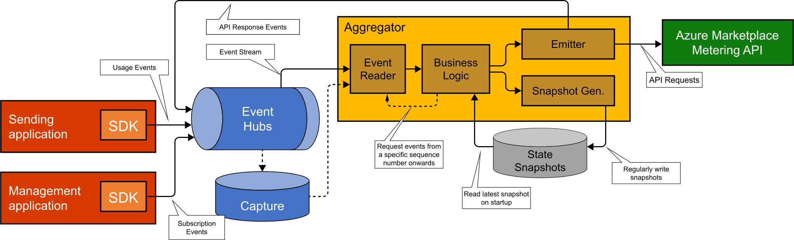
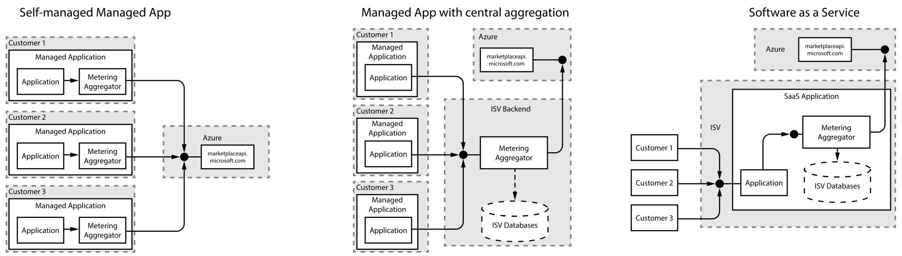
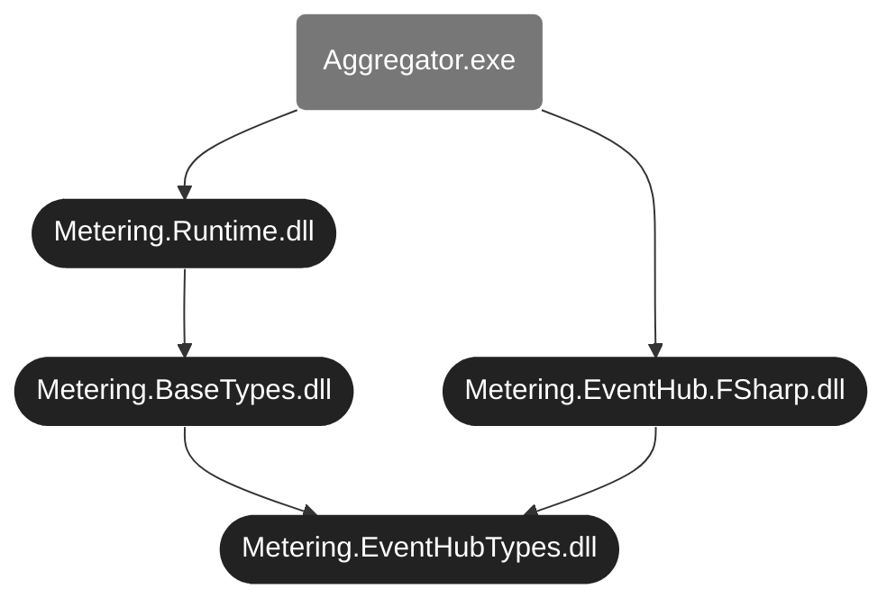

# `README.md`: The metering-billing-accelerator

## tl;dr

> This component takes care of the accounting necessary for correctly reporting custom metering information to the Azure Marketplace Metering API. 

## Design goals

- Allow the application developer to submit all relevant usage events via a light-weight SDK, and not worry about the intricacies of Azure Marketplace Metering.
- Support all current (January 2022) Azure Marketplace offer types which can support custom meters, i.e. both Azure Managed Applications, as well as Software-as-a-Service. 
- Main audience are 'small' ISVs, i.e. software companies which intend to bring a new offering into Azure Marketplace, but who might not yet have existing massive investments into billing and accounting infrastructure. 
- The hosting costs should be minimal, preferably no premium services like CosmosDB etc..
- Robust and resilient: The solution should easily hum along in presence of failures. If a component fails, it'll catch up the next time it runs. Just make sure the compute component runs a few times a day.
- Hosting-agnostic: The compute component should be able to be hosted on a broad variety of compute paradigms, such as slapping it onto already existing virtual machine, or into an Azure function, a Docker container in ACI or K8s, or an on-premises Raspberry Pi.
- Just do the right thing (TM).
- Support various authentication mechanisms, i.e. both service principals, as well managed identity.
- Capture rich historic information, to enable future scenarios, such as analytics for customer retention, usage statistics, etc.
- Capture the full history of the system state, i.e. allow event sourcing.
- Have a 'comparably' lightweight client-SDK, i.e. rely on supported Azure SDKs for the actual heavy-lifting.
- JSON for messages in EventHub, as well as for state representation.

## Which challenges does it solve for?

ISV developers who want to enable their [managed application][azure-app-metered-billing] or SaaS offers to leverage metered billing, and therefore need to submit metered billing data to the "[Azure Marketplace / Metered Billing API][marketplace-metering-service-apis]", have to solve a similar set of challenges. 

> *"You must keep track of the usage in your code and only send usage events to Microsoft for the usage that is above the base fee."*

### Tracking *included* usage and *overage* usage

In addition to the (monthly or annually) recurring base fee, a marketplace offer/plan can include "optional dimensions" for usage which is not included in the flat rate. The solution has to keep track of the overall usage, and only send (aggregate) usage events to Microsoft for usage *above* the base fee. 

So the system needs to differentiate between "included" usage events, which are have already been accounted for by paying the base fee, and "overage" consumption, which must be reported to Microsoft, so that the Azure team can charge the ISV customer.

For an application developer, it certainly would be easier to just track usage, whenever it occurs, and have 'somebody else' do the proper accounting. This solution lets the developer to just report that express: *"This stuff happened right now, please, take care of potentially charging the user, if it's not included in the base fee."*

 ### Replenishment at the right point in time

At an all-you-can-eat buffet, someone should just take care of refilling / replenishing the buffet, when it's time for a refresh. Customers can subscribe to an Azure Marketplace offer at an arbitrary point in time. For example, a customer might buy the solution at the 7th of March, at 18:30 their local time, therefore expect that, when the monthly subscription renews on the 7th of April an 18:30, the 'included quantities' are re-filled for the next billing cycle - The buffet is refilled with fresh good (free) things.

So the solution must understand when each subscription was initially created, how many monthly and/or annual quantities are included, and therefore when to reset the corresponding consumption counters. 

### Showing the customer what's left for the current billing cycle

As a customer, I'd love to understand how much of the resources I already paid for are still available for consumption. For example, if I purchased an offer which includes 10 expensive machine learning jobs in the monthly fee, and I used 8 already, and the unconsumed 2 jobs (left-overs) expire in a few days, I might want to consume these, before the new billing cycle starts. 

Microsoft's Azure Marketplace backend system certainly has a good understanding of the current (billable) consumption, but due to the design, Microsoft doesn't have any information about consumption within the included quantities, as that is solely tracked inside the ISV solution. 

Surfacing that information can help customers to make good cost-conscious decisions. 

### Azure Metering API requirements

#### Hourly aggregation

When submitting (overage) values to the metering endpoint, the usage must be aggregated on an hourly basis, i.e. all overage usage must be collected / aggregated per subscription/plan/dimension/hour. *"Only one usage event can be emitted for each hour of a calendar day per resource."*  [[src](https://docs.microsoft.com/en-us/azure/marketplace/marketplace-metering-service-apis#metered-billing-single-usage-event)]

#### Write-once / First write wins / No updates

The practical implication is that, when submitting values to the Azure Marketplace Metering API, the first write for a given hour must be correct, as it cannot be subsequently updated upon arrival of additional information. 

#### Batching

Ideally perform batch submissions to the metering API, to enable an efficient transfer of data.

## Architecture



The system is an event-sourced accounting solution, which uses Azure EventHub (in conjunction with EventHub Capture) as single-source-of-truth for everything that happens in the system. In addition, it uses an Azure blob storage container for snapshots of the most recent system state.

### Recording usage

Metering information enters the system by having a tiny thin layer on top of the EventHub SDK. The sending application creates JSON-formatted messages, and submits these into EventHub. Once successfully submitted, the usage is reliably recorded. 

For the aggregator to properly function, it is completely controlled through messages coming through EventHub. In the simplest case, the sending application is supposed to send two types of events: 

- A `SubscriptionCreationInformation` ([src](./Metering.BaseTypes/SubscriptionCreationInformation.fs)) event describes an Azure Marketplace subscription, which corresponds to either a single managed application, or a SaaS subscription. This data structure contains 

  - a description of the plan 
    - (plan name, 
    - dimensions, 
    - included quantities), 
  - as well as the unique ID of the subscription, 
  - the renewal interval (monthly/annually), 
  - and the DateTime when the subscription was created. 

  For each subscription, this event is only sent once, at the beginning, to instruct the aggregator to start tracking usage for that subscription.

- An `InternalUsageEvent` ([src](./Metering.BaseTypes/InternalUsageEvent.fs)) represents the consumption of 'something' that needs to be tracked, and contains 

  - the resource ID of the marketplace resource (SaaS subscription ID, or managed app ID), 
  - a timestamp, 
  - an application-internal name of the consumed meter, 
  - the consumed quantity, 
  - as well as optional metadata (key/value collection), to enable the ISV to build richer reporting.

### Aggregating usage

The "aggregator" is a .NET-application, which reads the most recently generated snapshot from storage (if any), and then processes all EventHub messages which arrived since the last successfully processed message. The aggregator certainly does not need to run 24x7, as long as it is regularly scheduled. You can run the aggregator on an existing VM, or in a (time-triggered) Azure Function, in a container-based offering (like AKS, or ACI), or wherever else you can run code (including your Raspberry Pi on your desk, if you're adventurous). 

It does not cause harm if the aggregator gets shut-down in the middle of the action, while aggregating data or submitting usage; on the next launch, it'll keep continue humming along from it's last good known state.

The architectural approach inside the aggregator is like this: The snapshot blob storage container contains all relevant state, up to a certain point in time. "Point in time" refers to a specific message sequence number in an Azure EventHub partition. When the aggregator starts, and get's ownership over one (or more) partitions in EH, it reads the most recent corresponding state (JSON files), and starts to continue sequentially processing all messages in the corresponding EventHub partition. 

The business logic sequentially applies each event to the state, i.e. applying / [folding][folding] the events onto the state. The EventHub SDKs `EventProcessorClient`, alongside with the business logic, are wrapped in a Reactive Extension's observable, which then continuously emits new versions of the state.

#### Business logicss

The business logic is completely side-effect-free; it's a "[pure function][pure function]" (in functional-programming terms), and it does not perform any interactions with the outside world. Most notably, when the business logic determines that a certain value is ready to be submitted to the external metering API, it just records a job entry, to indicate that 'someone' is supposed to make that API call. 

Two subsequent functionalities subscribe to the stream of state updates: 

- One task regularly stores the most recent state in Azure blob storage, in the snapshot container. Having that state enables us to quickly catch-up to the most recent point in time.
- The second task continuously checks the state for ready-to-be-submitted data to the Azure Marketplace API. It looks in the state for jobs, submits the usage data to the external API. 

#### Submission to Marketplace API

The aforementioned task, that submits usage to Azure marketplace, might (partly) fail for various reasons. It submits up to 25 usage values in a single API call, so it could be that some of these values are accepted by Marketplace, while others might be rejected for various reasons. For example, the resource ID might not exist, the customer might have cancelled their subscription, or the time slot might be too far back in the past, older than 24 hours, maybe because you had an outage, and didn't run the aggregator often enough.

Whatever the outcomes of the marketplace API calls are, the responses are fed back into the EventHub instance; you can see the feedback link from "Emit to metering API" back into EventHub. Therefore, our business logic can observe whether a certain usage item has been successfully submitted to the marketplace metering API, or whether there was an error.

**Idempotency and resilience:** In case of a successful submission to Marketplace, the business logic removes the item from the collection of API calls that need to be made. The idempotent nature of the Azure Marketplace API is very beneficial for this architectural style. Imagine our API-calling emitter calls the marketplace API (submits usage for a certain time slot), but the overall aggregator gets shut-down by some infrastructure failure (VM going down, Azure Function timeout, pod eviction). In this example, the usage has been submitted (successfully) to the marketplace API, but we haven't been able to properly record that success in EventHub. When the aggregator is scheduled to run again (minutes or hours later), the emitter will submit the usage (again), and record the response in EventHub. For the business logic, it does not matter whether the response was a '200 OK' from the initial write, or a duplicate error; in both cases, we know that marketplace successfully processed our usage data.

## Data structures

### Client messages

The sequence of messages sent by a client looks like this: A `SubscriptionPurchased` event must inform the aggregator about the details of a new subscription. After that initialization, the `UsageReported` messages continuously inform the aggregator of metering event which must be accounted for. Finally, a `SubscriptionDeleted` message stops aggregation of events, and instructs the aggregator to stop tracking usage for the given subscription:


The aggregator is designed to track multiple subscriptions.

#### The `SubscriptionPurchased` event

The following JSON message instruct the aggregator to start tracking usage for the subscription with the subscription ID `fdc778a6-1281-40e4-cade-4a5fc11f5440`. This monthly recurring (SaaS) subscription was purchased on the 4th of November 2021, at 16:12:26 UTC, i.e. the first billing month ends December 4th, 16:12:25 UTC. 

The `value/subscription/plan` element provides the Azure Marketplace plan's financial details, i.e. name of the plan (`'planId'`), and the collections of custom metering dimensions, including their name, and how many units are included `monthly` and `annually`. 

This customer purchased a plan called `free_monthly_yearly` in the partner portal, which lists 5 marketplace metering service dimensions, called `nodecharge`, `cpucharge`, `datasourcecharge`, `messagecharge` and `objectcharge`. Each of these has a 'monthly quantity included in base price' of 1000 units, and an 'annual quantity included' of 10000 units. 


In addition, it contains a `metersMapping` table, which translates the application's internal name for a consumption event, such as `'cpu'`, into the dimension name which is officially configured in Azure marketplace, such as `'cpucharge'`.  

The concrete JSON message (in EventHub) looks like this

```json
{
  "type":"SubscriptionPurchased",
  "value":{
    "subscription":{
      "scope":"fdc778a6-1281-40e4-cade-4a5fc11f5440",
      "subscriptionStart":"2021-11-04T16:12:26Z",
      "renewalInterval":"Monthly",
      "plan":{
        "planId":"free_monthly_yearly",
        "billingDimensions": {
          "messagecharge":    1000,
          "cpucharge":        1000,
          "datasourcecharge": 1000,
          "nodecharge":       1000,
          "objectcharge":     1000,
        }
      }
    },
    "metersMapping":{
      "msg": "messagecharge",
      "cpu": "cpucharge",
      "dta": "datasourcecharge",
      "nde": "nodecharge",
      "obj": "objectcharge"
    }
  }
}
```


#### The `UsageReported` message

The actual usage / consumption message emitted by the ISV application into EventHub looks like this, indicating that the `cpu` meter (which is known to Azure under the official name `cpucharge`) has consumed 3.1415 units on 09:57:29 UTC (which is the application's internal time).

```json
{
    "type": "UsageReported",
    "value": {
        "internalResourceId": "8151a707-467c-4105-df0b-44c3fca5880d",
        "timestamp":          "2022-01-27T09:57:29Z",
        "meterName":          "cpu",
        "quantity":           3.1415
    }
}
```

### State file (for a single partition)

The JSON file in this section describes the state of partition #3 in EventHub, up to sequence number `10500`. If the aggregator would start with this state, it will start reading from event sequence number `10501` onwards. This tiny example tracks currently only a single (SaaS subscription) `8151a707-467c-4105-df0b-44c3fca5880d`. In a production setting, the `meters` dictionary would contain many more subscriptions.

The `subscription/plan` item describes this in detail; having information on when a subscription has been purchased (`subscriptionStart`), alongside with the information on what is included in each dimension of the plan, allows the aggregator to refill the included quantities at  the start of each new billing cycle.

**Internal versus external dimension names:** So the concrete dimension names that must be used externally with the Azure API are `objectcharge`  and the other ones. To avoid that the developers of a solution have to hard-code these  into the actual software implementation, the `metersMapping` table introduces a level of indirection: When reporting usage onto the system, the ISV's software can say that the `obj` meter should be incremented by 3.1415 units. The accelerator understands that the internal `obj` meter actually corresponds to what Azure marketplace knows as `objectcharge`.

```json
{
  "meters": {
    "8151a707-467c-4105-df0b-44c3fca5880d":{
      "metersMapping": { // maps internally used names to the configured marketplace dimension name. 
        "msg": "messagecharge",
        "cpu": "cpucharge",
        "dta": "datasourcecharge",
        "nde": "nodecharge",
        "obj": "objectcharge"
      },
      "subscription":{
        "scope": "8151a707-467c-4105-df0b-44c3fca5880d",              
        "subscriptionStart": "2021-12-14T18:20:00Z",
        "renewalInterval": "Monthly",
        "plan":{
          "planId": "free_monthly_yearly",
          "billingDimensions": {
            "messagecharge":    1000,
            "cpucharge":        1000,
            "datasourcecharge": 1000,
            "nodecharge":       1000,
            "objectcharge":     1000,
          }
        }        
      },
      "currentMeters":{
        "messagecharge":    { "included": { "quantity": 1000 } },
        "cpucharge":        { "included": { "quantity": 1000 } },
        "datasourcecharge": { "included": { "quantity":  982 } },
        "nodecharge":       { "consumed": { "consumedQuantity": 11018.8 } },
        "objectcharge":     { "consumed": { "consumedQuantity":   118   } }
      },
      "usageToBeReported": [ // These are API calls which must be made
        {
          "resourceId":"8151a707-467c-4105-df0b-44c3fca5880d",
          "effectiveStartTime":"2021-12-22T09:00:00Z",
          "planId":"free_monthly_yearly", "dimension": "nodecharge", 
          "quantity": 5.0
        }
      ],
      "lastProcessedMessage":{ // When was the meter fdc778a6-1281-40e4-cade-4a5fc11f5440 updated?
        "partitionId":"3", "sequenceNumber":"10500", "partitionTimestamp":"2021-12-22T10:32:37.48Z"
      }
    }
  },
  "lastProcessedMessage": { // When was the overall state last updated?
    "partitionId":"3", "sequenceNumber":"10500", "partitionTimestamp":"2021-12-22T10:32:37.48Z"
  },
  "unprocessable":[
      // If there have been messages in EventHub which could not be processed, 
      // they are stored here.
  ]
}
```

**Counting the consumption**: In the above example, you can see 5 dimensions in different states for the given sample customer:

- The `messagecharge` and `cpucharge` meters have an `"included": { "quantity": 1000 }` value, which indicates that there has not been any consumption in these dimensions, as their values are untouched (compared to the plan).
- The `datasourcecharge` meter has a value of `"included": { "quantity":892 }"`, which indicates that 108 units have already been consumed (in the current month). This snapshot is from 22nd of December. Given that the subscription was purchased on the 14th of December, and the renewal interval is `Monthly`, the `included` will be re-filled to `1000` on the 14th of January.
- The `nodecharge` and `objectcharge` meters completely depleted the included quantity for the current month and are now in the overage (indicating the overage for the current hour!!!), i.e. having values of `"consumed":{"consumedQuantity":11018.8, ...}` and `"consumed":{"consumedQuantity":118,...}` respectively. 

For the `nodecharge` meter, you can also see that the `usageToBeReported` array contains an object `{ "planId":"free_monthly_yearly", "dimension":"nodecharge","resourceId":"fdc778a6-1281-40e4-cade-4a5fc11f5440","quantity":5.0,"effectiveStartTime":"2021-12-22T09:00:00Z"}`, indicating that the usage emitter must report a `free_monthly_yearly/nodecharge = 5.0` consumption for the 09:00-10:00 time window on December 12th, 2021.

The `usageToBeReported` array contains a TODO list of API call bodies to be submitted to the Azure Marketplace Metering API.

## Configuration via environment variables

### Azure Marketplace API credential (to submit metering values to Azure)

- For a SaaS solution, you must use a service principal credential, ie. you must set the values
  - `AZURE_METERING_MARKETPLACE_CLIENT_ID` and `AZURE_METERING_MARKETPLACE_CLIENT_SECRET`: These are the ones you configured in the Marketplace partner portal, alongside with your
  - `AZURE_METERING_MARKETPLACE_TENANT_ID`: This is the Azure AD tenant ID of your ISV tenant
- For a managed application, you will use the managed app's managed identity, i.e. you must NOT set these `AZURE_METERING_MARKETPLACE_...` values. If these are missing, the solution uses Managed Identity.

### Infrastructure Credentials

The solution needs to be able to access Azure EventHub and Azure Storage. You can use either a service principal credential for both, or managed identity for both. 

- For service principal, set `AZURE_METERING_INFRA_CLIENT_ID`, `AZURE_METERING_INFRA_CLIENT_SECRET` and `AZURE_METERING_INFRA_TENANT_ID`.
- For managed identity, just don't set these values.

> Partial settings (setting only one or two out of the `*_CLIENT_ID/*_CLIENT_SECRET/*_TENANT_ID` tuple will result in the application not starting. You have to set all three (for service principal), or none (for managed identity).

### Endpoints

Configure the appropriate endpoints for EventHub and Storage via environment variables:

- EventHub
  - Set `AZURE_METERING_INFRA_EVENTHUB_NAMESPACENAME` and `AZURE_METERING_INFRA_EVENTHUB_INSTANCENAME` with the *pure* names, like `meteringhack` and `hub1`.
  - The eventhub namespace name is the  first part of the hostname in the connection string `Endpoint=sb://meteringhack.servicebus.windows.net/`.
  - The instance name corresponds to the  connection string's `EntityPath=hub1`.
- Storage
  - Set `AZURE_METERING_INFRA_CHECKPOINTS_CONTAINER` to the checkpoints container's URL  (will be used by the EventHub SDK's `EventProcessorClient`) 
  - Set `AZURE_METERING_INFRA_SNAPSHOTS_CONTAINER`, where the solution stores the aggregator state. **This is the long-term database of the system!!!**
  - Set `AZURE_METERING_INFRA_CAPTURE_CONTAINER` for the ability to read through EventHub capture.
  - Set `AZURE_METERING_INFRA_CAPTURE_FILENAME_FORMAT` to the proper format of the blobs in the capture container, something like `{Namespace}/{EventHub}/p{PartitionId}--{Year}-{Month}-{Day}--{Hour}-{Minute}-{Second}`, namely the value from the EventHub'r ARM configuration, `archiveDescription.destination.properties.archiveNameFormat`. 
    Check the [documentation][eventhub-capture-format] for details

### Local dev setup

For local development, set a few environment variables. On Windows, you can set the local user's environment variables with this script:

```cmd
setx.exe AZURE_METERING_MARKETPLACE_CLIENT_ID             deadbeef-1234-45f7-ae17-741d339bb986
setx.exe AZURE_METERING_MARKETPLACE_CLIENT_SECRET         sitrsneit239487234~nienienieni-ULYNE
setx.exe AZURE_METERING_MARKETPLACE_TENANT_ID             foobar.onmicrosoft.com

setx.exe AZURE_METERING_INFRA_CLIENT_ID                   deadbeef-1234-4aef-80d1-83b052e58b42
setx.exe AZURE_METERING_INFRA_CLIENT_SECRET               sitrsneit239487234~nienienieni-ULYNE
setx.exe AZURE_METERING_INFRA_TENANT_ID                   foobar.onmicrosoft.com

setx.exe AZURE_METERING_INFRA_EVENTHUB_NAMESPACENAME      meteringhack-standard
setx.exe AZURE_METERING_INFRA_EVENTHUB_INSTANCENAME       hub2

setx.exe AZURE_METERING_INFRA_CHECKPOINTS_CONTAINER       https://meteringhack.blob.core.windows.net/checkpoint
setx.exe AZURE_METERING_INFRA_SNAPSHOTS_CONTAINER         https://meteringhack.blob.core.windows.net/snapshots

setx.exe AZURE_METERING_INFRA_CAPTURE_CONTAINER           https://meteringhack.blob.core.windows.net/hub2capture
setx.exe AZURE_METERING_INFRA_CAPTURE_FILENAME_FORMAT     {Namespace}/{EventHub}/p{PartitionId}--{Year}-{Month}-{Day}--{Hour}-{Minute}-{Second}

setx.exe WSLENV AZURE_METERING_MARKETPLACE_CLIENT_ID/u:AZURE_METERING_MARKETPLACE_CLIENT_SECRET/u:AZURE_METERING_MARKETPLACE_TENANT_ID/u:AZURE_METERING_INFRA_CLIENT_ID/u:AZURE_METERING_INFRA_CLIENT_SECRET/u:AZURE_METERING_INFRA_TENANT_ID/u:AZURE_METERING_INFRA_EVENTHUB_NAMESPACENAME/u:AZURE_METERING_INFRA_EVENTHUB_INSTANCENAME/u:AZURE_METERING_INFRA_CHECKPOINTS_CONTAINER/u:AZURE_METERING_INFRA_SNAPSHOTS_CONTAINER/u:AZURE_METERING_INFRA_CAPTURE_CONTAINER/u:AZURE_METERING_INFRA_CAPTURE_FILENAME_FORMAT/u:
```

## Demo time - How to run / try it yourself

The service principal `AZURE_METERING_INFRA_CLIENT_ID` must have access (read/write to both the `AZURE_METERING_INFRA_EVENTHUB` event hub, as well as the checkpoints blob storage, the snapshot blob storage, and read access to the eventhub capture blob storage).

There are currently two CLI console apps to try it out:

- The `Demos\EventHubDemo` is the aggregator. 
  - It aggregates events, and displays stuff on screen. You can't interact with it. 
  - When you stop it, and restart it, it might take up to a minute until you see output, as it's battling leadership election games with it's previous incarnation on who owns which EventHub partition.
- The `Demos\SimpleMeteringSubmissionClient` is your demo app to submit real values.
  - Before you can see anything usefull, you must create a subscription: Type `c 1` for example, which (c)reates a new subscription. The code takes the `1`, and generates a GUID from it. 
    So unfortunately you can't see that `1` in the `Demos\EventHubDemo`, only the corresponding GUID. 
  - You can create multiple subscriptions, e.g. type `c 2` and `c 3`, and create more subs to play with
  - After you have a subscription, you can (s)ubmit metering values, by saying `s 1 20`, which sends a usage event of 20 units for the subscription GUID which corresponds to the `1`.
  - Once you have pressed the return button, an event goes into EventHub, and you should see metering values on the `Demos\EventHubDemo` side change.

### Example

Run these commands

- `c foo`: This (c)reates a subscription. The demo app converts the string `foo` into a GUID `b5c7ee0b-3fea-db0f-c95d-0dd47f3c5bc2`, and submits an event creating a new subscription.
- `s foo 99`: This submits the consumption to the subscription `b5c7ee0b-3fea-db0f-c95d-0dd47f3c5bc2`
- `s foo 900`: This submits the consumption to the subscription `b5c7ee0b-3fea-db0f-c95d-0dd47f3c5bc2`
- `s foo 13`: This submits the consumption to the subscription `b5c7ee0b-3fea-db0f-c95d-0dd47f3c5bc2`

Somewhere in the output, you will see this (at different spots):

```
 0 b5c7ee0b-3fea-db0f-c95d-0dd47f3c5bc2:   cpucharge: Remaining 1000
 0 b5c7ee0b-3fea-db0f-c95d-0dd47f3c5bc2:   cpucharge: Remaining 901
 0 b5c7ee0b-3fea-db0f-c95d-0dd47f3c5bc2:   cpucharge: Remaining 1
 0 b5c7ee0b-3fea-db0f-c95d-0dd47f3c5bc2:   cpucharge: 12 consumed
```

When the subscription was created (check the `plan.json` file in the `SimpleMeteringSubmissionClient` directory), these details were included in the plan:

```json
{
  "cpucharge": "1000",
}
```

You can see an included (monthly) quantity of 1000. This is reflected in the output:

```text
 0 b5c7ee0b-3fea-db0f-c95d-0dd47f3c5bc2:   cpucharge: Remaining 1000
```

- Once you (s)ubmit a usage of 99 units (by typing `s foo 99`), the `Remaining 1000` become `Remaining 901`
- Once you (s)ubmit a usage of 1000 units (by typing `s foo 900`), the `Remaining 901` become `Remaining 1`
- The last consumption of 13 units fully depletes the remaining 1 credits, and brings you into the overage, i.e. the included quantity of `Remaining 1` becomes `12 consumed`

## Supported deployment models

The metering accelerator is planned for three distinct deployment models:

1. 'Self-managed' Managed napplication
2. Managed Application with Central Aggregation
3. Software as a Service (SaaS)

> NOTE: Currently, the "Managed App with Central Aggregation is still in the design phase".



### 'Self-managed' Managed Application

In this model, a [managed application][azure-app-metered-billing] directly submits metering information to Azure. The ISV bundles a copy of the metering aggregator into each managed application deployment, i.e. each managed application deployment can autonomously submit its own usage data. 

The advantage of that model is that, from an ISV perspective, it's has a very low maintenance overhead, because the ISV can trust all customer deployments continuously working without the ISV's intervention. 

The disadvantage is that the ARM template for the managed app needs to contain the aggregator components (storage, event hubs and compute), and that each managed app deployment incurs runtime costs (most notably event hubs and compute), resulting in higher infrastructure costs for the ISV's customers.

### Managed Application with Central Aggregation

> NOTE: Support for this model is not yet fully designed and implemented.

To address the downsides of the *"'Self-managed' Managed Application"* approach, ISVs can decide to run a central instance of the metering aggregator in the ISV's own backend. In this model, all managed application deployments send their usage across the organizational boundary to the ISV. The ISV-hosted metering aggregator centrally aggregates usage across all managed app deployments, and submits metering data centrally to Azure.

The advantage of that approach is that the managed apps do not incur hosting costs for the metering accelerator. However, the ISV needs to ensure availability of the metering aggregator backend, so all managed apps can successfully emit their usage.

Another advantage is that the ISV centrally captures all usage of app deployments, enabling analytics scenarios, such as customer retention analysis, or recommending better-suited plans to customer who always have included quantities left over at the end of the billing period.

### Software as a Service (SaaS)

In the case of a SaaS offering, the ISV has to centrally run the metering accelerator (as integral part of the SaaS offer). The multi-tenanted SaaS application submits usage data for all SaaS customer into the central instance. 

## Assembly overview

This gives an overview about the DLL dependencies



- `Metering.EventHubTypes.dll` contains a few base abstractions related to Azure EventHub (SequenceNumbers, PartitionIDs, etc.)
- `Metering.BaseTypes.dll` contains the core data types and their JSON serializations
- `Metering.Runtime.dll` contains the integration with the outer world, such as Azure Identity, Blob Storage, EventHub
- `Metering.EventHub.FSharp.dll` and `Metering.EventHub.dll` contain the Reactive Extensions wrapper around the EventHub SDK. The F# version will be retired soon.

## TODO

- [ ] compensating action / compensating usage for an unsubmittable api call, it it exists. needs to make handleevent recursive
- [x] marketplace client to support batch
- [ ] collect plans separately in JSON to avoid duplication
- [ ] Floats can be negative

## Missing features

- [ ] Instrumentation, logging, metrics

## Privacy and Telemetry Notice

When you deploy/run this software, it regularly submits usage/metering data to the Microsoft Azure Metering API; in fact that's its main reason to exist. It is supposed to aggregate your customer's software usage information, and to submit it to `https://marketplaceapi.microsoft.com` (or `https://saasapi.azure.com`, which seems to be the more modern hostname for the metering API).  *If you don't want that, don't use it.* You can't turn that off via configuration.

Besides that, it does **not** send any telemetry, error reporting, etc., to Microsoft. 

For Microsoft in general, you can find our privacy statement at https://go.microsoft.com/fwlink/?LinkID=824704. 

## Wild ideas

- [ ] track per meter which hours have been ever submitted in a large bitfield. 
  - 365days/year * 24h/day * 1bit/(h*meter) / 8bit/byte * (4/3 extension due to base64)== 1460 byte/(year*meter). 
  - With an additional overhead of 1460 bytes per year and meter, we can track which in which hours we have submitted metering values.

## Contributing

This project welcomes contributions and suggestions.  Most contributions require you to agree to a
Contributor License Agreement (CLA) declaring that you have the right to, and actually do, grant us
the rights to use your contribution. For details, visit https://cla.opensource.microsoft.com.

When you submit a pull request, a CLA bot will automatically determine whether you need to provide
a CLA and decorate the PR appropriately (e.g., status check, comment). Simply follow the instructions
provided by the bot. You will only need to do this once across all repos using our CLA.

This project has adopted the [Microsoft Open Source Code of Conduct](https://opensource.microsoft.com/codeofconduct/).
For more information see the [Code of Conduct FAQ](https://opensource.microsoft.com/codeofconduct/faq/) or
contact [opencode@microsoft.com](mailto:opencode@microsoft.com) with any additional questions or comments.

## Trademarks

This project may contain trademarks or logos for projects, products, or services. Authorized use of Microsoft trademarks or logos is subject to and must follow 
[Microsoft's Trademark & Brand Guidelines](https://www.microsoft.com/en-us/legal/intellectualproperty/trademarks/usage/general).
Use of Microsoft trademarks or logos in modified versions of this project must not cause confusion or imply Microsoft sponsorship.
Any use of third-party trademarks or logos are subject to those third-party's policies.

[azure-app-metered-billing]: https://docs.microsoft.com/en-us/azure/marketplace/azure-app-metered-billing "Metered billing for managed applications using the marketplace metering service"

[marketplace-metering-service-apis]: https://docs.microsoft.com/en-us/azure/marketplace/marketplace-metering-service-apis "Marketplace metered billing APIs"

[eventhub-capture-format]: https://docs.microsoft.com/en-us/azure/event-hubs/event-hubs-resource-manager-namespace-event-hub-enable-capture#capturenameformat "EventHubs Capture Format "

[pure function]: https://en.wikipedia.org/wiki/Pure_function "Pure Function"

[folding]: https://en.wikipedia.org/wiki/Fold_(higher-order_function) "Fold (higher-order function) on Wikipedia"
