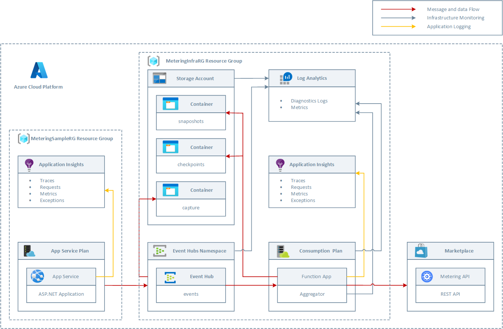
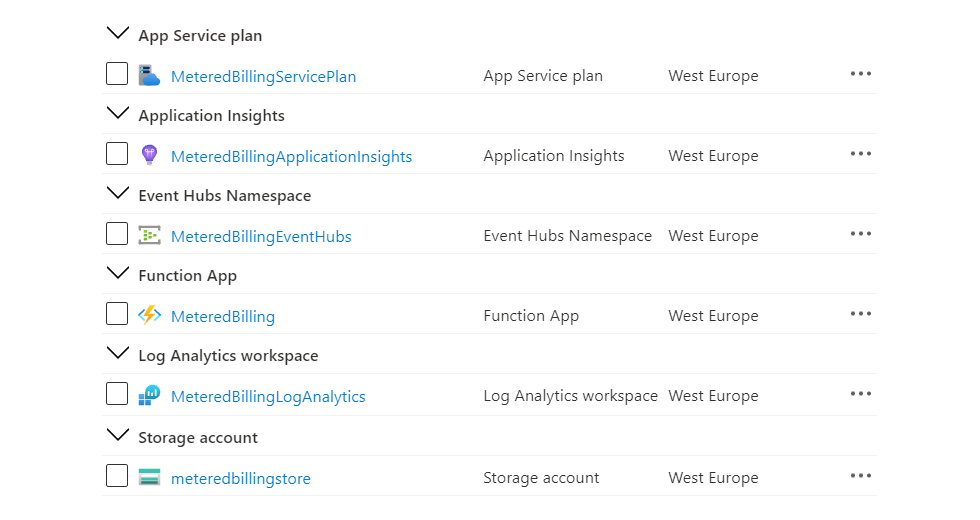
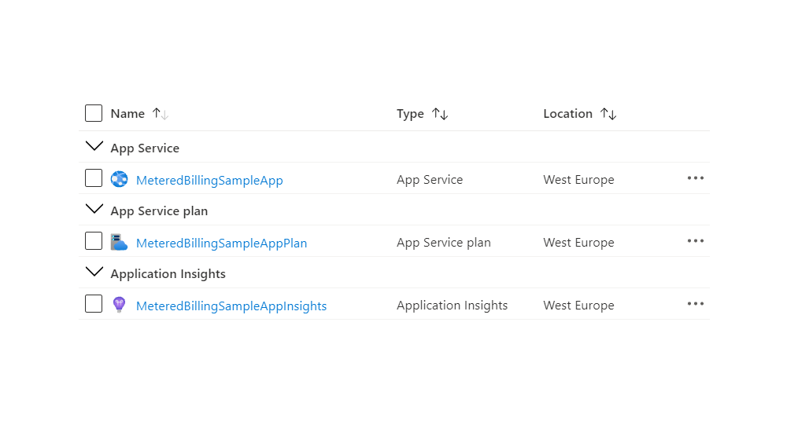

# Architecture #

The following picture shows the architecture and network topology of the sample.

The ARM template under the **templates/infra** folder deploys the following resources to the **MeteringInfraRG** resource group:

- A Blob Storage Account with 3 containers:
  - **checkpoints**: this container will host the blobs, one for each Event Hub partition, used by the **Aggregator** Azure Function and in particular by the [EventProcessorClient](https://docs.microsoft.com/en-us/azure/event-hubs/event-hubs-dotnet-standard-getstarted-send) to handle the ownership of the Event Hub partitions using the [Leader Election](https://docs.microsoft.com/en-us/azure/architecture/patterns/leader-election) pattern. For mlore information, see [Balance partition load across multiple instances of your application](https://docs.microsoft.com/en-us/azure/event-hubs/event-processor-balance-partition-load).
  - **snapshots**: this container will used by the **Aggregator** Azure Function to store partial aggregated results.
  - **capture**: this store will be used to capture the streaming data in the **events** Event Hub in the Azure Blob Storage Account. For more information, see [capture the streaming data in Event Hubs in an Azure Blob storage](https://docs.microsoft.com/en-us/azure/event-hubs/event-hubs-capture-overview).
- A Consumption Plan used to host the **Aggregator** Azure Function.
- An Azure Functions App used to run the **Aggregator** Azure Function with a [system-assigned managed identity](https://docs.microsoft.com/en-us/azure/active-directory/managed-identities-azure-resources/overview). This identity is assigned the following roles at the resource group scope to grant it gthe necessary permissions to receive events from the Event Hub and read/write blobs to the Storage Account:
  - [Azure Event Hubs Data Owner](https://docs.microsoft.com/en-us/azure/role-based-access-control/built-in-roles#analytics)
  - [Storage Blob Data Owner](https://docs.microsoft.com/en-us/azure/role-based-access-control/built-in-roles#storage)
- A Log Analytics workspace used to collect diagnostics logs and metrics from all the Azure services used by the solution.
- An Application Insights used to collect traces and exceptions generated by the **Aggregator** Azure Function.

The ARM template under the **templates/sample** folder deploys the following resources to the **MeteringSampleRG** resource group:

- An Hosting Plan used to host the sample web app
- An App Service in the above hosting plan used to host the sample WebApp
- An Application Insights used to collect traces and exceptions generated by the sample web app.

## Deployment ##

You can use the **deploy-infra.sh** script under the **scripts** folder to deploy the infrastructure necessary to run and monitor the solution. The following figure shows the resources deployed by the ARM template in the **MeteringInfraRG** resource group.

You can use the **deploy-sample.sh** script under the **scripts** folder to deploy the infrastructure necessary to run and monitor the solution. The following figure shows the resources deployed by the ARM template in the **MeteringSampleRG** resource group.

You can even use the GitHub Actions workflows under the **github/workflows** folder to deploy both the **MeteringInfraRG** and **MeteringSampleRG** resource groups. For more information on how to deploy ARM templates using GitHub Actions, see the following resources:

- [Deploy ARM templates by using GitHub Actions](https://docs.microsoft.com/en-us/azure/azure-resource-manager/templates/deploy-github-actions)
- [Automate the deployment of JSON ARM templates by using GitHub Actions](https://docs.microsoft.com/en-us/learn/modules/deploy-templates-command-line-github-actions/)
