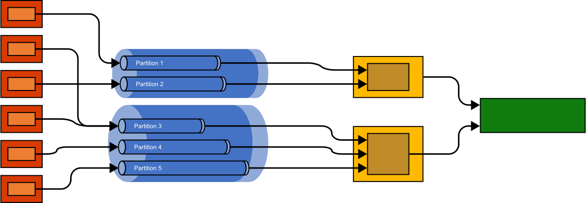

# 2022-04-25 09:58:37 Scaling and Migrations

## Currently available scaling options

The Metering Accelerator consists of two scalable parts, EventHubs and the compute that is hosting the aggregator. The compute must be *fast enough* to read through events arriving in EventHubs. The main mechanism for horizontal scaling is the number of partitions in the EventHubs instance, or if that isn't sufficient, having multiple EventHubs instances in parallel.

The business logic requires all events for a given subscription to end up in the same EventHubs partition, so that the aggregator reads all events in a linear fashion with defined ordering. So the solution uses the SaaS subscription ID, or the managed resource group's ID, as partition key.

This document describes strategies on how we can implement support for migrations, and scaling:

- **Migration:** A migration could be that the system should use a different EventHubs instance (and storage account / containers for snapshots and capture)
- **Up- or Down-Scaling:** Use a different EventHubs instance, or multiple instances, for example with a different set of partitions.

For example, in a 'small' deployment, an ISV might start off with an EventHubs instance with 5 partitions, and might want to scale up partition count to a larger number.


Even though EventHubs [supports scaling-up the number of partitions in an event hub](https://docs.microsoft.com/en-us/azure/event-hubs/dynamically-add-partitions), this is not applicable to this solution, given that a changed partition number changes the hashing scheme, and events for a certain metering subscription might end up in a different partition in the existing event hub.

Or, in a different scenario, the system should be split across multiple EventHubs, for example in different Azure regions.



## Strategy

### Step 1: Re-configure clients to send to the new EventHubs instance

As a first step, create the new EventHubs instance, and reconfigure the clients to send traffic to the new instance. The 'old' EventHubs instance should not receive any new production traffic.

### Step 2: Process remaining unprocessed events in the old EH instance

The old aggregator needs to process all remaining events in the old EventHubs instance, and ensure everything has been applied to the state files for the various partitions.

### Step 3: Consolidate state across all state files (from the old partitioning scheme)

```
int oldPartitionCount = oldEventHub.getPartitionCount()
BlobContainer migrationStateContainer = ...

foreach (partitiontId in oldPartitionCount) {
	oldState = readOldPartitionFile (partitionId)
	foreach (subscription in oldstate) {
		storeSubscriptionAsIndividualBlob(subscription, migrationStateContainer)
	}
}
```

