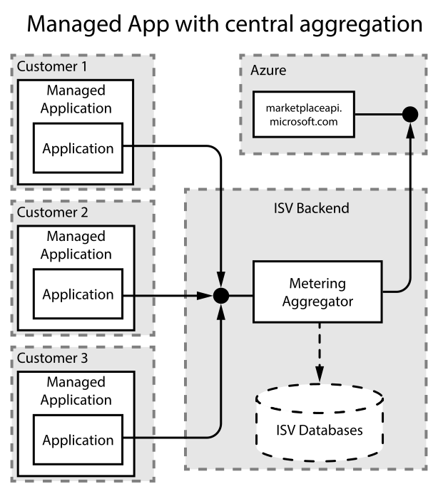
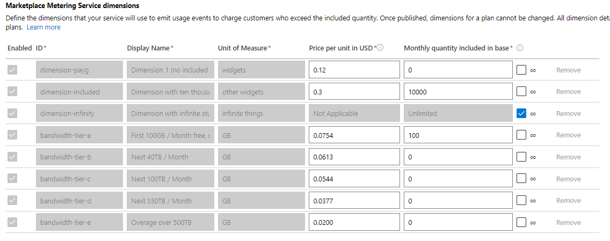
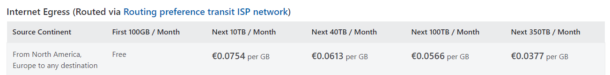
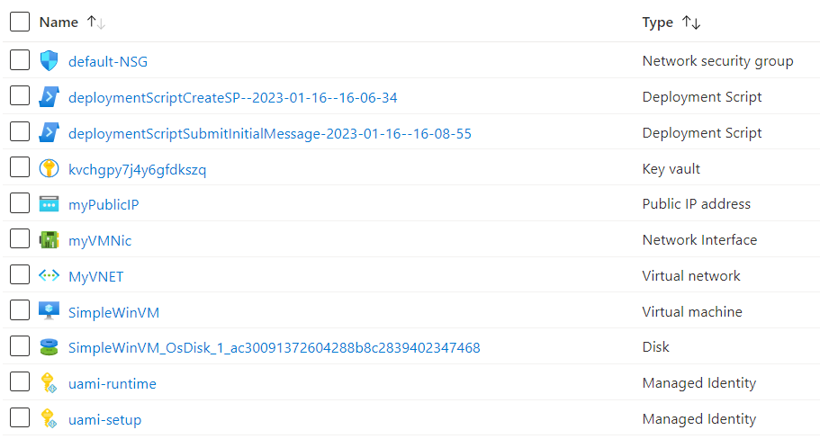

# Full demo with a managed application

## Overview

This page contains a full walkthrough of a deploying the end-to-end-scenario. The sample will use a 'managed app with central aggregation' approach, i.e. the publisher will run the metering aggregator in the ISV-hosted backend. All managed application deployments will send their usage to that central instance.

### Billing dimensions

We will create a managed app, with a monthly billing cycle. We will define a couple of billing dimensions in our offer, like these:

You can see quite a few dimensions here, but from an application perspective, we will only have 4. The first three will be 'simple' billing dimensions, for counting simple overage; there might be included quantities in the monthly price, or even an infinite amount of it in the monthly price. The 4th dimension will implement a waterfall pricing, described below:

1. The `dimension-payg` is a sample for a simple pay-as-you-go dimension, i.e. all usage will be directly charged to the customer. (Directly means in the aggregated, in the hour in which it occurred).

2. The `dimension-included` is a billing dimension which has 10 000 included items in the monthly price. All usage beyond these 10 000, i.e. the overage, will be charged, similar to the `dimension-payg` earlier.

3. The `dimension-infinity` is a billing dimension which is counted, i.e. the application can emit usage about it into our system, but we will never report any overage for it into the Azure metered billing API, because the customer "purchased an infinite amount of `dimension-infinity`" 

   - This can be helpful when you have multiple plans, some in which this dimension is completely included in the monthly fee, while others might have to pay for it. By modeling it as 'Unlimited', we can have our application just emitting usage for it, but not having to care whether the specific customer has an unlimited plan or not.

4. The marketplace metering service dimensions in the screenshot above (`bandwidth-tier-a`, `bandwidth-tier-b`, `bandwidth-tier-c`, `bandwidth-tier-d` and `bandwidth-tier-e`) together will be configured in the metered billing accelerator as a single "waterfall" dimension, internally just called `bandwidth`. Here, we model the way how Microsoft charges for [bandwidth](https://azure.microsoft.com/en-us/pricing/details/bandwidth/): The pricing page indicates that the first 100GB each month are free, the next 10TB have a certain price per GB, the next 40TB have a lower price per GB, and so forth:

   Azure Marketplace does not describe this as a supported billing model, but with the help of the metered billing accelerator, we can define a waterfall dimension and implement it internally. 

   So our application just emits usage events for `bandwidth`, and the metered billing accelerator determines whether a gigabyte falls into the free tier, whether it fits int the `bandwidth-tier-a` (Next 10TB / Month), or one of the higher tiers. On the Azure pricing page, you can see that customers who send more than 500,1 TB into the Internet should "Contact us", and Microsoft doesn't list a price. However, our solution needs to know how to properly handle that overage, and that's what `bandwidth-tier-e` is for, i.e. overage above 500TB (and our 100 included GBs). 

Once deployed, the managed application will contain 

