# Azure Function monitoring on Azure

**Application Insights** monitors running Azure function. It tells publisher about failures and performance issues, and helps publisher to analyze how customers use the thier application.

It's essential to monitor a modern application while it is running. Most importantly, publisher wants to detect failures before most of his customers do. 

Also publisher want to discover and fix performance issues that, while not catastrophic, perhaps slow things down or cause some inconvenience to their users. 

publisher can set up [availability tests](https://docs.microsoft.com/en-us/azure/azure-monitor/app/monitor-web-app-availability) for any HTTP or HTTPS endpoint that's accessible from the public internet. publisherYou don't have to make any changes to the website you're testing. The following steps will show HOW-TO deploy [availability test](https://docs.microsoft.com/en-us/azure/azure-monitor/app/monitor-web-app-availability) for Azure function in **general**. 

### 1- Enable Application Insights for Azure function (in case if it not installed)
If the application Insights feature is not enabled. Publish will enable it as following 

After turning the feature on, Click on **Enable** then **Apply**
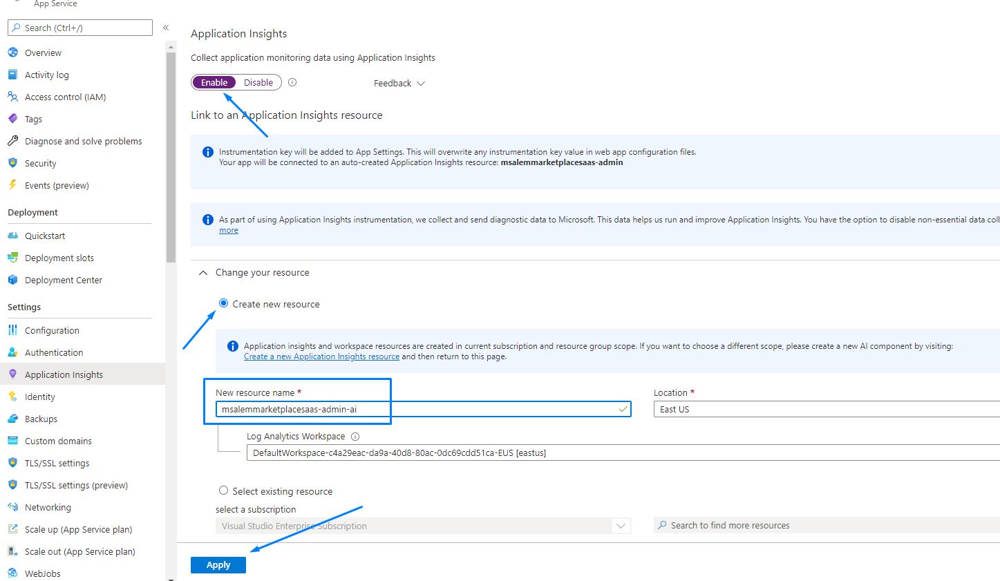

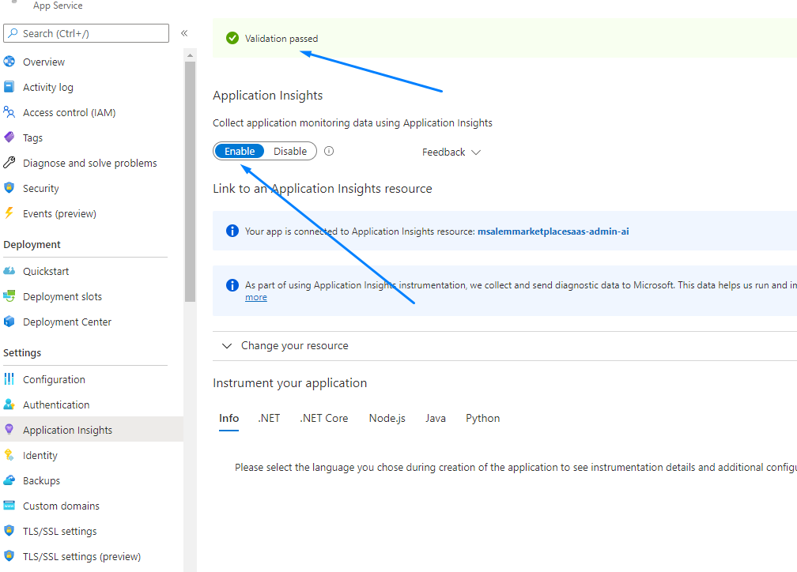

### 2- Access Application Insight dashboard
After the installion complete the Application Insights services will be accessible from the Azure function or resource group.

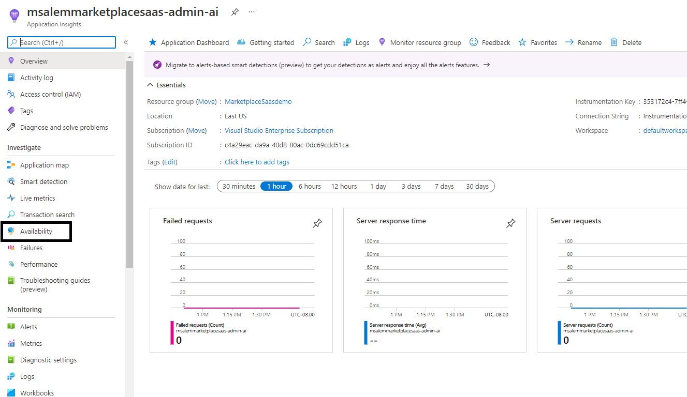

Notice the Availability feature on the left panel.

### 3- Create Availability Test
From Availability Landing page Click **Add Standard (preview) Test** 

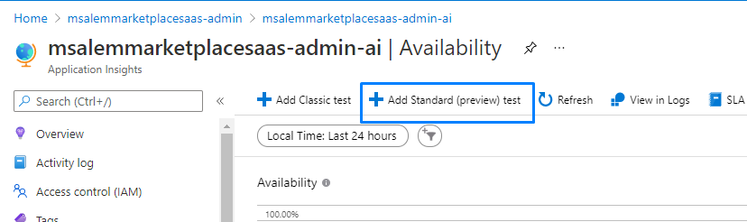

Fill the test basic information, make sure to enter the URL for the Azure function 
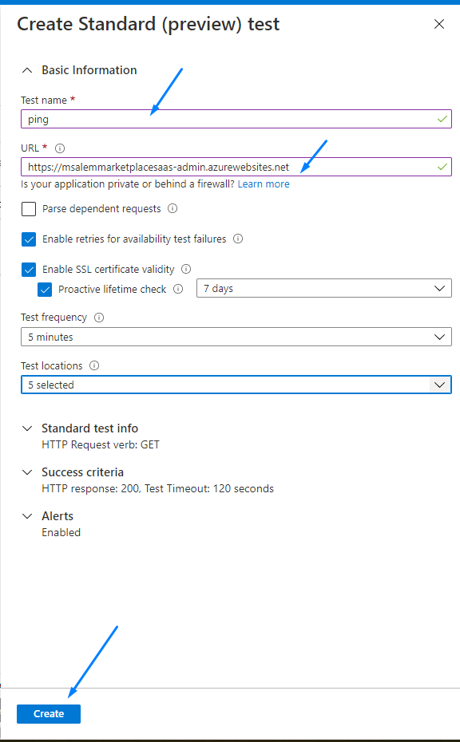

**Note**: you can select up to 5 test locations world wide.  From **Test Location** you can pick 5 location base on SaaS geographic target
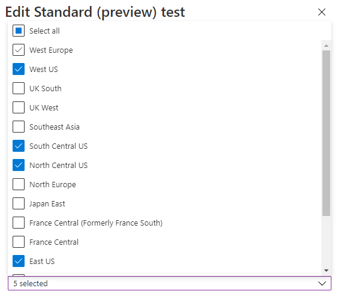

The Availabity test is  created and deployed now and will get a similar dashboard like this
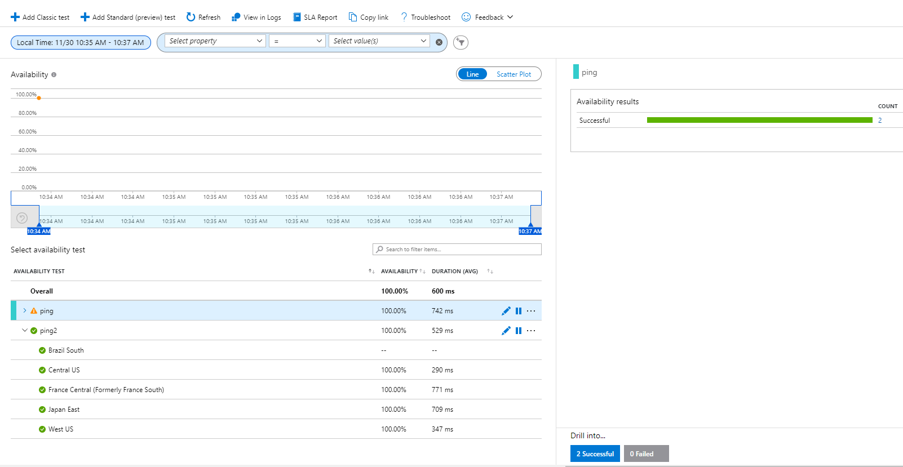

### 4- Alerts
Under Application Insight Alerts you can monitor and query different alerts and based on Severity you can edit the alert and change the delivery mechanism 
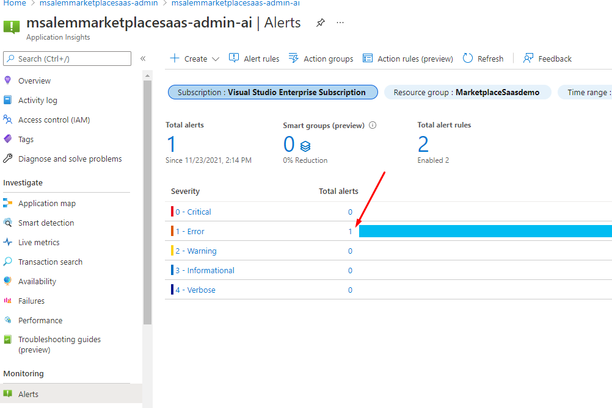

To Edit the Alert for Availability Test. Click on **Alert Rules**

By Default Availability will create an alert for the availability test you created earlier
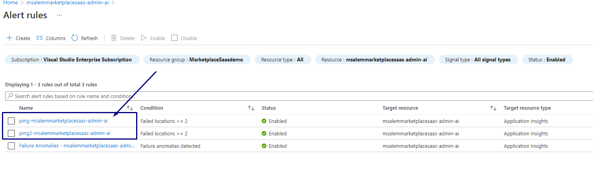

Click on Availability test Alert 
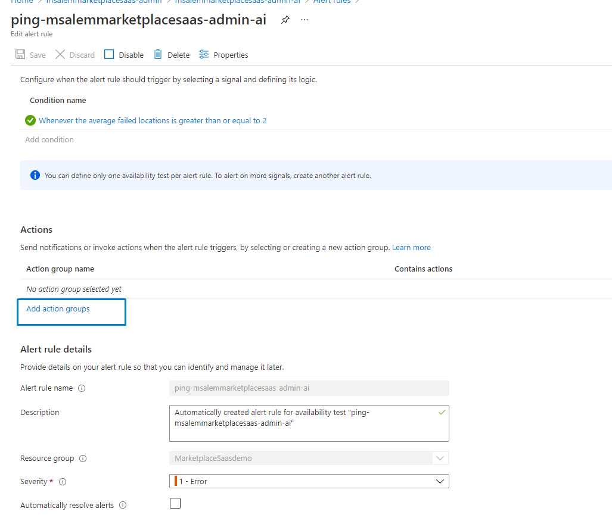

Notice the [Action Groups](https://docs.microsoft.com/en-us/azure/azure-monitor/alerts/action-groups) section. Click on action groups
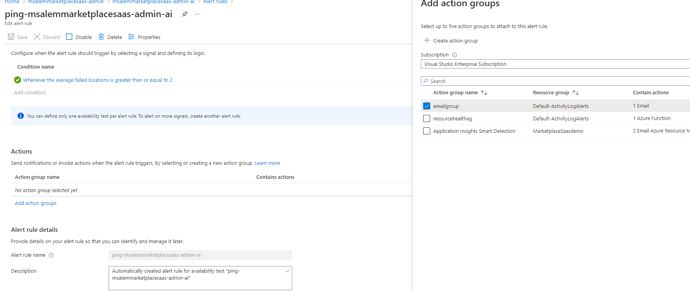

Select the Email Group, and fill the alert detail email and click create.

If you need to changethe email of the peron/group to be notified, click on Edit Action Group and edit the email/SMS information
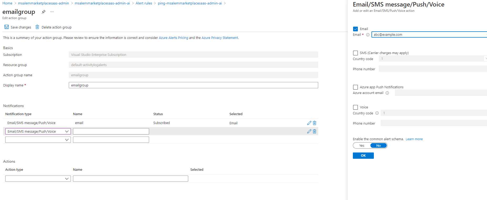

For more about the **Action Groups**]** please refer to [Microsoft Docs](https://docs.microsoft.com/en-us/azure/azure-monitor/alerts/action-groups).

### Summary
This section shows How-To 
- Enable Application Insights
- Create Availability Test
- Change Alert to notify group or person.

### Other Monitor Recommendation
- [Event Hub Monitoring and Alert instruction](./Event-Hub-Monitoring.md).
- [App Registration Credentials Monitoring and Alert instruction](./App-Reg-Monitoring.md).
