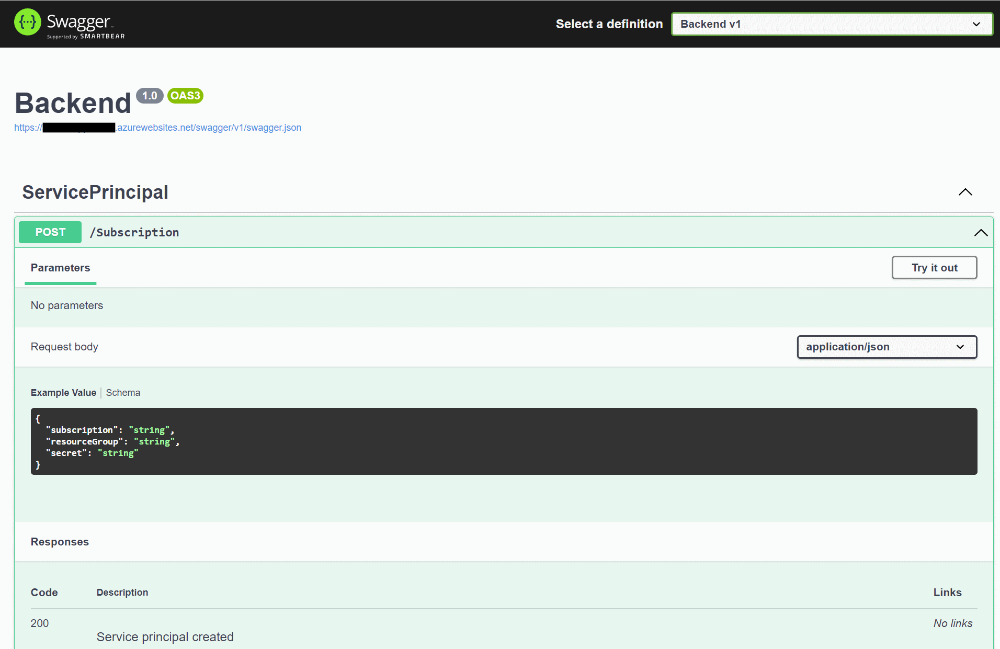

# Installation

Theres two parts to the installation.

1. **Publisher backend** orchestrates assigning of permissions and creating the service principle
2. **Managed application** which will register itself with the publisher and retrieve a service principle that can access a service on publisher side

## Publisher backend

The script for publishing is using a bash script to provision the backend, as theres no way to create Azure AAD applications, AAD users and groups in ARM/BICEP without using embedded deploymentScripts.  

Theres two scripts in place. Frist one creates the backend, the last one creates the resources which are being shared.

1) [setup.sh](../scripts/ISVBackend/setup.sh) contains all steps to setup the backend. Main components are:
   * Create a **resource group** for the publisher backend
   * Create AAD **security group**. Group will be assigned the permissions needed for the scenario - like Contributor to an storage account, message queue,  event hub etc.
   * **Key Vault** which holds the two secrets, Bootstrap secret used when ARM installs a managed resource and the secret managed applications passes when sending life cycle events.
   * **Application service and web application** to host the backend API. 
   * **User Assigned managed identity**, used by the web application for getting access to key vault and for creating Service principals.
   * Once above is provisioned,  the `Backend` solution can be deployed to the web application created. 
     * A swagger contract is exposed and be be used for testing. Secret can be passed *either* in Authorization header or in the payload. The secret is available in the key vault and name `BootstrapSecret`. If yo 
2) [setupSharedResourcegroup.ps1](../scripts/ISVBackend/setupSharedResourcegroup.ps1) contains the provisioning of the resources being shared. *Change this to fit your scenario, by including the resources you need and assigning the roles to the group*. Service principals created by the backend are added to this group and will have the permissions assigned to the group.
   1) Creates a **resource group** to hold the shared resources
   2) Creates a storage account - the resource being shared in this scenario
   3) Assign permissions to the security group (create in previous step) granting members storage contributor rights.

## Managed application 

Once the backend is provisioned and deployed, a managed application can be deployed. A skeleton is provided in the [ManagedSolution](../scripts/ManagedSolution) folder. There are a few central BICEP modules/pieces:

1) `publisherKV` takes the publisher Azure subscription id and the key vault and resource group containing the key vault. Because the publisher Key Vault is [enabled for ARM deployments](https://docs.microsoft.com/en-us/azure/azure-resource-manager/managed-applications/key-vault-access), the managed application can fetch a secret from the Key Vault. The secret 'Bootstrap' is stored in the Key Vault
2) `RegisterWithPublisher` is the central part, where the Bootstrap secret is used as an authentication token, to call the Backend deployed previously.   This deploymentScript calls the backend (at the publisher) and returns client credentials (client Id and secret)
3) `KeyVault` deploys a Key Vault in the managed application and stores the bootstrap secret which is fetched from the publisher Key Vault
4) `Webapp` deploys a web app with a system assign managed identity. The managed identity is granted access to the Key Vault
5) `CustomerAttribution` injects the [tracking identifier](https://docs.microsoft.com/en-us/azure/marketplace/azure-partner-customer-usage-attribution) used for application usage tracking

Essentially, this is the central application which the customer deploys. So, you, the publisher needs to apply the same principles: use Managed Identity to get client credentials from the the Key Vault, and then connect to the Azure services using the bearer token. This needs to be done from your application. Here, its just a sample webapp that reads the client credentials from key vault.

#### Generating a package for upload to Azure marketplace

The [Build.sh](../scripts/ManagedASolution/Build.sh) creates a zip package that can be uploaded to Azure marketplace. 

