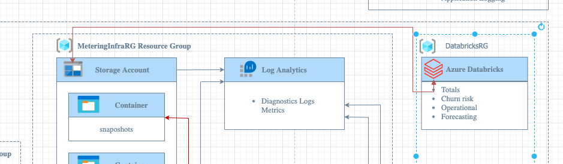

# `Analytics.md`: Getting Insights From Data

## tl;dr

> This chapter would identify key elements in obtaining few insights from the data captured by the solution, sales and operational aspects. The data analytic solution would focus on leveraging Azure Databricks.

## Design goals

The same design goals as for the entire solution are also valid in the data analytics section.

### Data Analytics Design Goals

- Agnostic Coding language - Python / SQL / Scala.

- Persona based analytics - recognize that each persona in the organization may have diffrent views and needs for insights.

## Analytics Use Cases

The following sections outlines the multiple personas in the organization, each will have his own set of needs.

### Sales

As sales manager I want to better understand how my products are used by my customers, main day/hour of use, understand the trends, and ensuring my current product match what my customer is using.
for example if I have a product of 50K units that is my most sold product and the overage on this product is beyond a threshold I defined - I need to know.

- revenu by product

- usage by product

- overage per product

other aggregations based on meta data of events?

### Operational

As an operational manager, I want to confirm total numbers of events my customer are generating, ensuring the meetering capacity can sustain the current load, and plan for future load.

- events totals (subscriptions, all events summerized).

- forcasting of totals, per day/hour.

- aggregation per subscription types.

### Customer Success

As part of the Customer Success jurney, an Account executive might want to share reports with customers, or become aware of the usage when speaking to his customers.

- aggregation per subscription - consumption trends (dates/hours) how am i consuming the services?

- Churn risk per subscription - ability to recognize customers who's behaviour might be an indication that they are either checking alternatives or going to stop using the product.

- Suggest potential other/addtional products to reduce cost.
