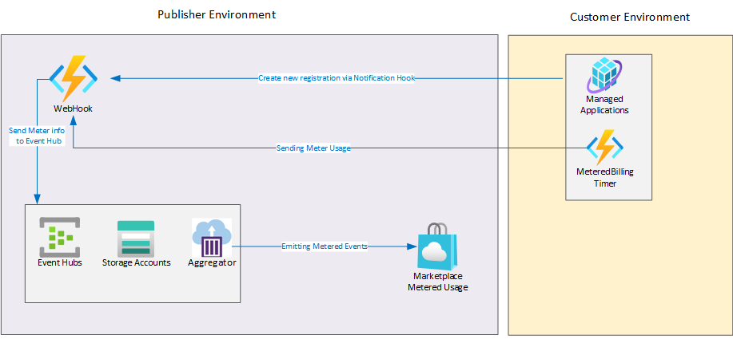
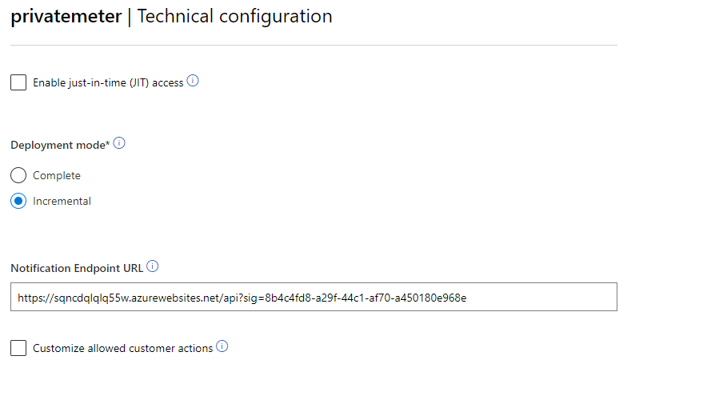
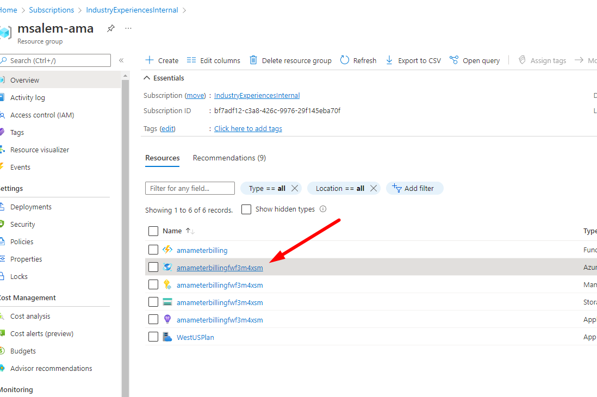
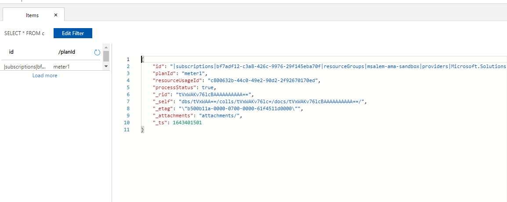
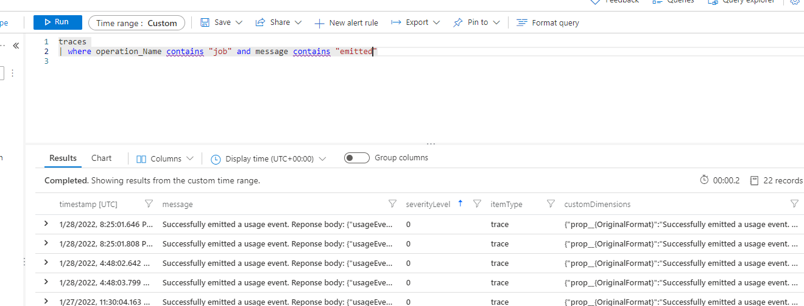

# Deploy Metered Listenner App for Azure Marketplace Managed-App:

This demo shows HOW-TO deploy azure function to listen to  managed app **Notification Endpoint URL** and emit meter usage events to marketplace using **predefined** dimensions and quantities based on config.

## Design
The following diagram shows the overall workflow for this demo




## Important Configuration
ARM template expects the following configuration
1. <b>tokenResource</b> This value should be set to `20e940b3-4c77-4b0b-9a53-9e16a1b010a7` [refer to the Marketplace Authentication doc](https://docs.microsoft.com/en-us/azure/marketplace/marketplace-metering-service-authentication)

1. <b>Variable artifacts:</b> ARM template will deploy function from a Zip file. This variable is used to reference to the location of the zip file

1. <b>DIMENSION_CONFIG</b> predefined dimensions and quantities that the function will use to emit usage event to Azure marketplace

## Deployment Sequence
1. Deploy [Billing Accelerator](https://github.com/msalemcode/metered-billing-accelerator-1/tree/main/scripts)
1. Deploy Publisher function and capture sig and notification URL
1. Update Managed App Main Template with Billing WebHook URL and sig 
1. Package the Managed App
1. Update Partner Center with the package and Notification URL from step#1
1. Test managed app by deploying and monitoring Application Insights


## Installation
Use ARM template under `arm` folder to deploy the meter monitoring system.
### Option #1
User could use Azure Portal to deploy the arm template using [Custom Deployment](https://portal.azure.com/#create/Microsoft.Template)

### Option #2
User could deploy the solution using Powershell commands 
```
git clone https://github.com/microsoft/commercial-marketplace-managed-application-metering-samples.git
cd commercial-marketplace-managed-application-metering-samples/function/ama-custom-billing-notification-webhook/arm

New-AzResourceGroupDeployment -ResourceGroupName <resource-group-name> -TemplateFile ./azuredeploy.json

```

## Installation from Partner Center

Use the Arm Template output result to configure managed app as following

Under Techical Configuration

1. <b>tenantId</b> => "Azure Active Directory tenant ID"

1. <b>identityApplicationId</b>=> "Azure Active Directory application ID"


Under plan technical configuration :

1. <b>webhookEndpoint</b> => "Notification Endpoint URL"




## Testing and Usage
1. Deploy the managed app as customer
2. From publisher tenant open the solution resource group, open CosmosDB

3. Open **Data Explorer** and check container records. There should be a record for the newly created mananged app.

4. From publisher tenant open the solution resource group, open the created Application Insights resource
5. From Logs, Run ther following query 
```
traces 
| where operation_Name contains "job" and message contains "emit"
```


6. Confirm there are successful emitting events

