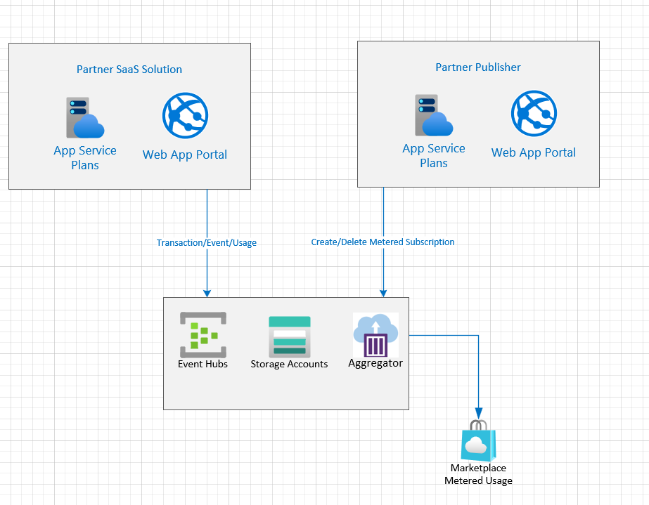

# SaaS-Metered-Demo

This is a simple demo for Azure OCR scanning function with Landing page capability as a Microsoft Azure Marketplace SaaS offer with Metered feature enables.

This code exists to show exercising the client library used.

## Demo Diagram


The demo consist of the following componets
1. Azure Web App: To demo Azure OCR scanning function and Landing code
2. Azure CosmosDB: To store OCR transcations in database
3. Azure Function: TO emit metered data to Azure Marketplace


## Prerequisites
1. [Create Azure Compute Vision Account](https://docs.microsoft.com/en-us/azure/cognitive-services/computer-vision/quickstarts-sdk/client-library?tabs=visual-studio&pivots=programming-language-csharp)
2. [Create Azure CosmosDB](https://docs.microsoft.com/en-us/azure/cosmos-db/introduction)


## Running Locally
Before running the application locally the following configuration should be in place.
1. MeteredPage: update the appsettings.json with the following configuration for ApplicationID and Secrets, Cosmosdb configuration and Azure OCR configuration
```
{
  "AzureAd": {
    "Instance": "https://login.microsoftonline.com/",
    "Domain": "YOUR_DOMAIN",
    "TenantId": "TENANT_ID",
    "ClientId": "CLIENT_ID",
    "ClientSecret": "CLIENT_SECRET",
    "CallbackPath": "/signin-oidc",
    "SignedOutCallbackPath ": "/signout-callback-oidc"
  },
  "MarketplaceApi": {
    "ClientId": "CLIENT_ID",
    "ClientSecret": "CLIENT_SECRET",
    "TenantId": "YOUR_TENANT_ID"
  },
  "Logging": {
    "LogLevel": {
      "Default": "Information",
      "Microsoft": "Warning",
      "Microsoft.Hosting.Lifetime": "Information"
    }
  },
  "AllowedHosts": "*",
  "subscriptionKey": "AZURE_OCR_SUB_KEY",
  "ocrEndPoint": "AZURE_OCR_END_POINT_URI",
  "CosmosDb": {
    "Account": "AZURE_COSMOSDB_ACCOUNT_END_POINT_URI",
    "Key": "AZURE_COSMOSDB_ACCOUNT_KEY",
    "DatabaseName": "AZURE_COSMOSDB_DATABASE",
    "ContainerName": "AZURE_COSMOSDB_CONTAINER"
  }
}
```

2. AzureFunction: 
- Rename local.settings-RenameMe.json  to local.settings.json
- Update the file with the following configuration
```
    "IsEncrypted": false,
    "Values": {
        "AzureWebJobsStorage": "UseDevelopmentStorage=true",
        "FUNCTIONS_WORKER_RUNTIME": "dotnet",
        
        "CosmosDb_Key": "AZURE_COSMOSDB_ACCOUNT_KEY",
        "CosmosDb_Uri": "AZURE_COSMOSDB_ACCOUNT_END_POINT_URI",
        "CosmosDb_Database": "AZURE_COSMOSDB_DATABASE",
        "CosmosDb_Collection": "AZURE_COSMOSDB_CONTAINER",

        "TenantId": "TENANT_ID",
        "ClientId": "CLIENT_ID",
        "ClientSecret": "CLIENT_SECRET",
        "Scope": "20e940b3-4c77-4b0b-9a53-9e16a1b010a7/.default"
    }
```

