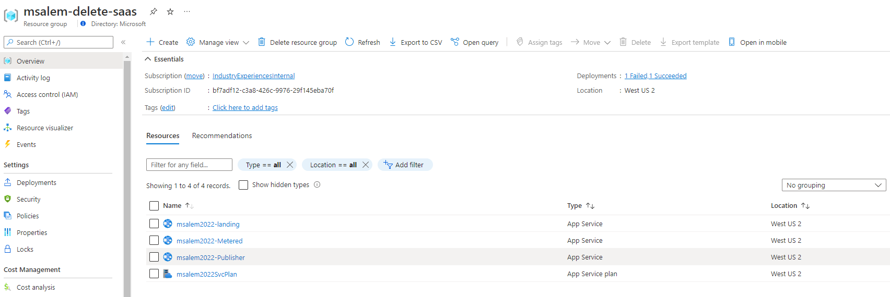
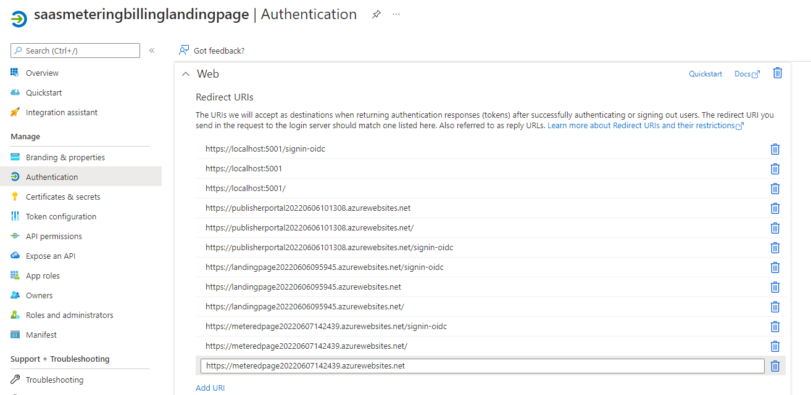
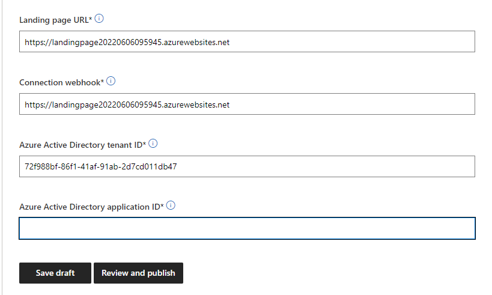
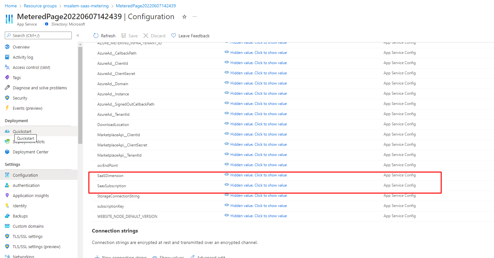
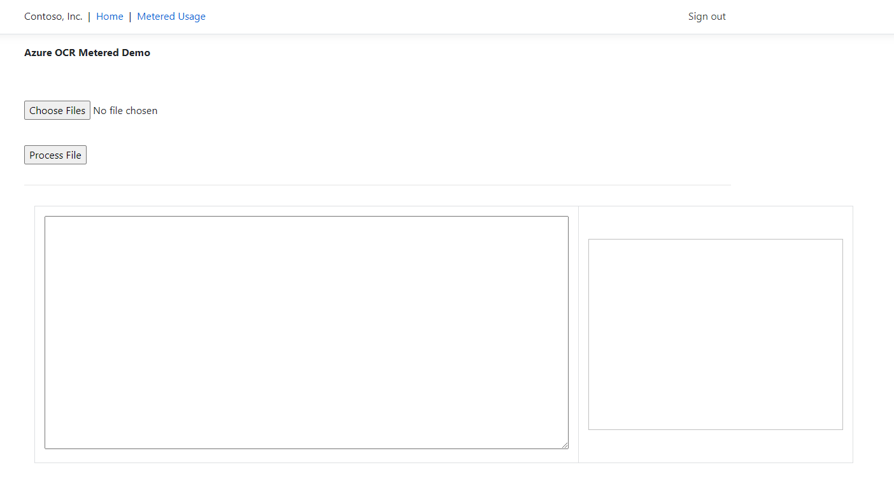
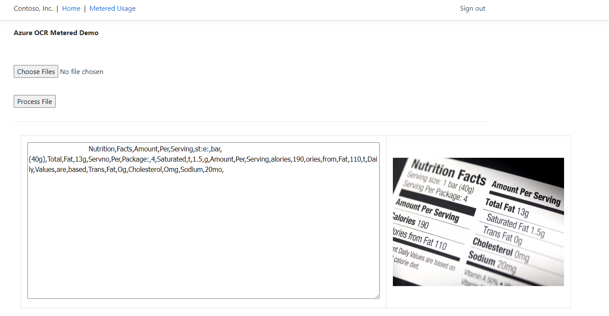
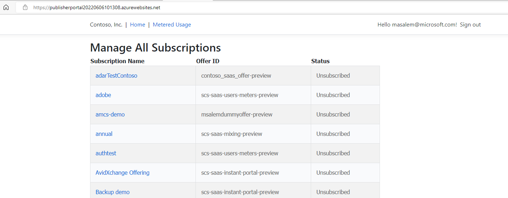
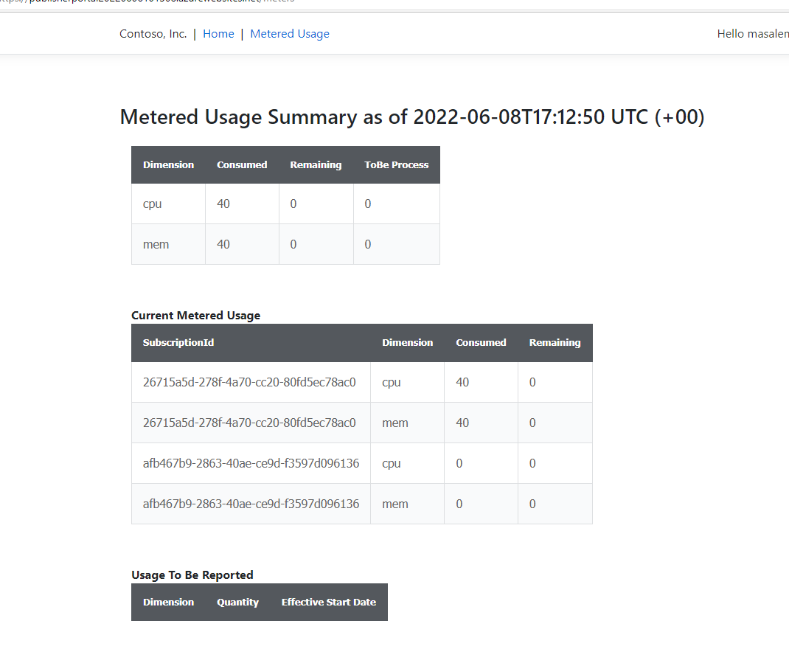

# SaaS-Metered-Demo

This is an example for SaaS Solution fully integrated with Metering SDK. The SaaS solution will be a demo for Azure OCR scanning where image will be scanned and extract words out. The total number of words will be emitting as metered event using Metered Billing Accelerator engine.

## Demo Diagram


The demo consist of the following componets
1. Landing Web App: Used by customer to subscribe for the SaaS Offer
2. Publisher Web App: Used to manage subscription and monitor **metered usage** for all subscriptions
3. Metered Web App: Used as SaaS Solution to scan images and  monitor **metered usage** for per customer subscription.


## Prerequisites
1. [Create Azure Compute Vision Account](https://docs.microsoft.com/en-us/azure/cognitive-services/computer-vision/quickstarts-sdk/client-library?tabs=visual-studio&pivots=programming-language-csharp)
1. Create [AAD App](https://docs.microsoft.com/en-us/azure/active-directory/develop/howto-create-service-principal-portal) single tenant for Marketplace SaaS API fullfilment
1. Create A[AAD App](https://docs.microsoft.com/en-us/azure/active-directory/develop/howto-create-service-principal-portal) multi tenant for for user authentication
1. Deploy [Metered Billing Accelerator](https://github.com/microsoft/metered-billing-accelerator/tree/main/deploy) 


## Compile and Publish the Solution
Compile and publish each solution as following starting from repo root location
```
cd .\src\PublisherPortal
dotnet publish -o .\Publish\PublisherPortal
Compress-Archive -Path .\Publish\PublisherPortal\* -DestinationPath .\Publish\PublisherPortal.zip -Force
cd ..
cd .\src\LandingPage
dotnet publish -o .\Publish\LandingPage
Compress-Archive -Path .\Publish\LandingPage\* -DestinationPath .\Publish\LandingPage.zip -Force
cd ..
cd .\src\MeteredPage
dotnet publish -o .\Publish\MeteredPage
Compress-Archive -Path .\Publish\MeteredPage\* -DestinationPath .\Publish\MeteredPage.zip -Force
```

## Deploy The solution in Azure Resource Group
Deploy **ARM Template** under `deployment/azuredeploy.json`. You can use Powershell as following 
```
New-AzResourceGroupDeployment -ResourceGroupName <resource-group-name> -TemplateFile ./deployment/azuredeploy.json
```

User could use Azure Portal to deploy the arm template using [Custom Deployment](https://portal.azure.com/#create/Microsoft.Template)

After deployment complete we will have 3 web application as following


## Redirect URIs for Azure AD Mutli Tenant Application 
After deployment complete will need to finialize the application. Goto Multi Tenant Application and add Publisher, LandingPage and MeteredPage URIs as redirect URIs.

## Create SaaS Offer in Partner Center
1. Create a SaaS Offer by following this [training material](https://microsoft.github.io/Mastering-the-Marketplace/saas/labs/lab1-create-pc-offer/). Make sure to create a Plan with Dimension. 
1. Create Plan with Dimension please refer to the following [training material](https://microsoft.github.io/Mastering-the-Marketplace/saas/#saas-metered-billing-overview)

## Configure SaaS Technical Requirement 
Under SaaS Offer Technical Requirement add the following Values from
1. LandingPage URL: This Landing webapp URL from the above deployment
1. Connection webhook: Use same URL like Landing page
1. Azure Active Directory tenant ID: SaaS Azure Tenant ID
1. Azure Active Directory application ID: Application ID create for Marketplace

## Purchase the offer
Please follow the following [training material](https://microsoft.github.io/Mastering-the-Marketplace/saas/labs/lab2-create-landing-page/#exercise-buy-your-offer-and-check-your-landing-page) to purchase your offer

## Activate Subscription
1. Please follow the following [training material](https://microsoft.github.io/Mastering-the-Marketplace/saas/labs/lab3-install-pub-portal/#exercise-as-the-publisher-activate-the-customers-subscription)
1. Capture the `SubscriptionId` from the activation screen

## Finalize SaaS Solution settings
1. From Azure portal, open metered webapp resource page
1. Click Configuration
1. Modify `SaaSSubscription` Key with `SubscriptionId`
1. Modify `SaaSDimension` Key with Plan Dimesnions using comma seperation.
1. Save Configuration

## Using SaaS solution to submit metering usage data
1. From Azure portal, open metered webapp URL
1. Login to webapp to access the main page 
1. Upload image to process
1. Click on Metered Usage to check usage

## Monitor Usage as Publisher
1. From Azure portal, open Publisher webapp URL
1. Login to webapp to access the main page 
1. Click on Metered Usage to check usage 
