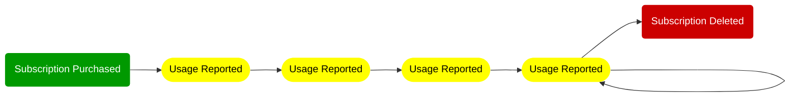

# A pattern for submitting Metering Billing events

This article describes an architectural pattern for properly and reliably aggregating consumption of Azure Marketplace offers, and submitting the consumption via the Azure Marketplace Metering API. 

The Marketplace Metering Service API allows ISVs to enable Azure Marketplace offers such as Azure Managed Applications or Software-as-a-Service applications to charge for consumption, according to custom billing dimensions, as defined by the ISV. As an ISV, you need to run a system which keeps track of the consumption in your application and submits the relevant usage to the Azure Metering Service, in an aggregated and timely fashion. 

> *Aggregated* means that you must cannot submit overage usage directly when it occurs, but aggregate all usage in a given hour. *Timely* refers to the fact that you ideally *should* submit usage in the hour after it occurred, but no later than 24 hours after the fact. According to the [FAQ](https://docs.microsoft.com/en-us/azure/marketplace/marketplace-metering-service-apis-faq), "*the best practice is to collect hourly usage and to emit is as one event at the end of the hour.*"

Your ISV solution report to the metering API that a certain customer subscription in the marketplace (who), consumed a specific amount of units (how much), of a certain billing dimension (what), in a given hour (when). A sample usage record might look like this:

```json
{
   "resourceId":"8151a707-467c-4105-df0b-44c3fca5880d",
   "effectiveStartTime":"2021-12-22T09:00:00Z",
   "planId":"free_monthly_yearly", "dimension": "nodecharge", 
   "quantity": 5.0
}
```

This usage event shows that the SaaS subscription `8151a707-467c-4105-df0b-44c3fca5880d` consumed an aggregated overage of 5.0 `nodecharge` units (in the `free_monthly_yearly` plan), on Wednesday, 22nd of December, 2021, sometime between 09:00:00 and 09:59:59 UTC.

The metering API accepts batches of up to 25 of these usage events to be submitted at once. 

Many ISV solutions share a common set of challenges: As a developer, you certainly want to focus on your solution's functionality, and not spend much effort on understanding how the Azure Marketplace's metering API needs to get your customer's usage information. Azure Marketplace offers with custom dimensions allow for sophisticated business models, which increase the complexity of the solution's billing logic. 

For example, for a given billing dimension, a Marketplace offer might have 'included quantities' for the monthly and/or annual fee. It is up to the ISV's solution, to correctly track and account for these included quantities. The ISV must only report customer usage *above* these included quantities, i.e., only the overage must be reported to Microsoft. In addition, at the time a customer's billing cycle renews, the ISV's accounting system needs to 're-fill' the customer's included quantities. 

**Timely:** The metering API requires ISV solutions to report usage in a timely fashion. The API only accepts usage events which belong to the last 24 hours; older usage events are rejected by the API. Therefore, the ISV's accounting and usage reporting solution needs to reliably and continuously submit usage; running an accounting job once a week is not sufficient. At the same time, the solution certainly doesn't need to run 24x7, as long as it submits data a couple of times a day.

**Aggregated:** The metering API requires usage data to be aggregated on an hourly basis. The ISV solution cannot simply forward all relevant metering events to the metering API, right in the instant when the occur. Instead, usage must be accumulated over an hour, properly handling potentially remaining included quantities, and only submit the overage usage to the metering API, for a past hour, that the customer really has to pay for.

**First write wins:** Last, but not least, the metering API only accepts a single 'first write' for a certain combination of marketplace subscription, billing dimension, and hour. Once the ISV solution reported that a certain consumption happened, subsequent submissions for the same subscription/dimension/timeslot will be rejected as a duplicate. The 'first write wins', and the customer will be charged accordingly. You want to avoid having to correct/update a previously submitted value. 

## The pattern

The pattern described in this document converts the Marketplace's Metered Billing API (which has very tight requirements) into a different API, which hopefully simplifies the development efforts for an ISV. While the Marketplace Metering Service API requires aggregated data in a certain shape and form, the ISV / application developer should be able to just report everything that happens, when it happens. 

### Architectural overview

The following illustration provides an architectural overview:


### Components in the system

- **Event Hubs:** The central component in the architecture is Azure Event Hubs, an 'append-only / log-based' data structure, which serves as source-of-truth for a pure, event-sourced application. Event Hubs contains the full 'transaction log' for everything that happens in the system. 
- **Event Hubs Partitions:** Event Hubs store messages in **[partitions](https://docs.microsoft.com/en-us/azure/event-hubs/event-hubs-scalability#partitions)**: a partition can be thought of like a 'transaction log': In our scenario, all messages relating to a certain (Azure Marketplace) subscription should always end up in the same Event Hubs partition, to ensure strict ordering, and therefore correct event sourcing. Event Hubs partitions assign a time stamp and a sequence number to each incoming message, i.e. each message / event can be uniquely identified by the partition's ID and a sequence number.
- **Event Hubs capture:** It is recommended to enable [Event Hubs Capture](https://docs.microsoft.com/en-us/azure/event-hubs/event-hubs-capture-overview). To avoid that EventHub gets 'too full', EventHub retains messages only for a specified retention period (days / weeks); older messages are removed from the hubs instance. Enabling Event Hubs Capture ensurec that a copy of the event messages is written (as Avro-serialized files) into Azure Blob Storage. That allows you to subsequently analyze and discover usage patterns in your solution, have an auditable log of customer consumption, or trouble-shoot problems. In addition, it allows a replay of a full series of past events in event sourcing.
- **Aggregator:** The aggregator is a (custom) component which contains the business logic. It is responsible to aggregate the consumption, and to submit the (overage) usage to the Azure Marketplace Metering API. Such an aggregator should ideally be written in a hosting-agnostic way: You might want to run it on a virtual machine on Azure, you might want it to run in Kubernetes on AKS, in an Azure Container Instance, an Azure Function, or on a Raspberry PI under your desk. The aggregator should provide you with the flexibility to host it in a way that works well for your solution.
- **State Snapshots:** A system like this should not exclusively rely on the log (Event Hubs + capture) as the entire data store. Event Sourcing should not force the solution to re-process the entire history, to calculate the state to a given point in time. Therefore, the aggregator should regularly create snapshots of the current system state. The aggregator serializes and stores these snapshots in blob storage.
- **Sending applications:** Multiple parts of the ISV solution might send data into the system:
  - For example, the actual ISV application sends the concrete usage events into EventHub, such as 'we performed a machine learning job for subscription 123', or 'we have processed 5.2 GB of data for subscription 435'. 
  - In addition to the actual usage, a management system might submit events like creation (or deletion) of a subscription, including the plan's details. 

## Responsibilities of the business logic

The business logic needs to properly aggregate usage, keep track of subscriptions, re-set counters when new billing cycles start, and ensure that usage is properly recorded with the Azure Marketplace Metering API. 

The business logic is designed to be free of side-effects. In this event sourcing design, the business logic only applies a single event to the system state, transforming it to the next version of system state. For example, So event # 1000 transforms the state version 999 to version 1000. 

### Aggregation

As mentioned earlier, the business logic should only have to consume the stream of events (coming out of Event Hubs) to determine the state of the system. The 'state of the system' reflects how the current usage of the solution is, for example whether a certain customer still has some remaining included quantities left for the current billing cycle, or whether a concrete meter is already in the overage consumption, so that the aggregated value must be reported when the new hour starts.

You could think about these meters like this:

| Resource ID           | Dimension              | Current Meter Value                                          |
| --------------------- | ---------------------- | ------------------------------------------------------------ |
| SaaS subscription 123 | Machine Learning Jobs  | **Included:** 8 jobs remaining for the current billing cycle |
| SaaS subscription 123 | Data processed (in GB) | **Overage:** 1.2 GB in the current hour (09:00 -- 09:59 UTC) (last update: 09:34) |
| SaaS subscription 435 | Machine Learning Jobs  | **Overage:** 0 jobs remaining for the current billing cycle. No usage in this hour. (09:00 -- 09:59 UTC) |
| SaaS subscription 435 | Data processed (in GB) | **Overage:** 5.2 GB in the current hour (09:00 -- 09:59 UTC) (last update: 09:20) |

A new 'usage' of 0.9 GB in data processing for 'SaaS subscription 435' at 09:45 UTC would increase the corresponding overage counter to 

| Resource ID           | Dimension              | Current Meter Value                                          |
| --------------------- | ---------------------- | ------------------------------------------------------------ |
| SaaS subscription 435 | Data processed (in GB) | **Overage:** 6.1 GB in the current hour (09:00 -- 09:59 UTC)  (last update: 09:45) |

Given these meters, once the clock reaches the new hour (10:00 UTC), the three meters with overage (from the previous hour) have to be submitted to the API, and then re-set to zero.

| Resource ID           | Dimension              | Current Meter Value                                          |
| --------------------- | ---------------------- | ------------------------------------------------------------ |
| SaaS subscription 123 | Machine Learning Jobs  | **Included:** 8 jobs remaining for the current billing cycle |
| SaaS subscription 123 | Data processed (in GB) | **Overage:** 0 GB in the current hour (10:00 -- 10:59 UTC)   |
| SaaS subscription 435 | Machine Learning Jobs  | **Overage:** 0 jobs remaining for the current billing cycle. No usage in this hour. (10:00 -- 10:59 UTC) |
| SaaS subscription 435 | Data processed (in GB) | **Overage:** 0 GB in the current hour. (10:00 -- 10:59 UTC)  |

### Billing cycles and subscription information

The business logic needs to be aware of the detailed subscription information, such as which offer has been purchased, date of the purchase, billing dimensions and the how many quantities are included monthly and/or annually:

- Resource ID: `"SaaS subscription 123"`
- Purchase Date: `"2021-11-04T16:12:26Z"`
- Azure offering Plan ID: `"contoso_machinelearning_and_processing"`
- Billing Dimensions and included quantities:

| DimensionName          | Monthly included | Annually included |
| ---------------------- | :--------------: | :---------------: |
| Machine Learning Jobs  |        10        |         0         |
| Data processed (in GB) |        0         |         0         |

This information allows the business logic to properly reset the counters regarding included quantities. For example, the customer with  `"SaaS subscription 123"` subscribed to the plan on 2021-NOV-04 at 16:12:26 UTC. As a result, exactly a month later (2021-DEC-04 at 16:12:26 UTC), the 'Machine Learning Jobs' counter needs to be re-set to 10 included jobs remaining for the new billing cycle.

### Facilitate Marketplace interactions and record results

We mentioned that the business logic is free of side effects, i.e., the business logic itself does not interact directly with the billing API. Instead, the system state contains a collection of overage items which are ready to be reported to the billing API. Let's illustrate that with a simple example:

- State #999 contains the following overage information:
  - `"SaaS subscription 123"` / "`Data processed (in GB) overage: 1.2 GB in the current hour (09:00 -- 09:59 UTC), last update: 09:34)`"
- Event #1000 from 10:02 UTC indicates a `Data processed: 0.1 GB`. Therefore, we know that the previous billing hour (09:00--09:59) is ready to be submitted. So event #1000 transitions state #999 to #1000.
- State #1000 contains the following information after applying event #10000:
  - `"SaaS subscription 123"` / "`Data processed (in GB) overage: 0.1 GB in the current hour (10:00 -- 10:59 UTC), last update: 10:02)`"
  - Overage **"ready to be submitted"** to the billing API:
    - `"SaaS subscription 123"` / `09:00 -- 09:59 UTC`: "`Data processed (in GB): 1.2 GB`

The list of "ready to be submitted" entries can also be seen as a TODO-list of API-calls to-be-made, so in the following, we use 'ready to be submitted' and 'API-call-to-be-made' synonymously. The actual submission the metering API happens independent from the business logic: The emitter process in the diagram below extracts all "ready to be submitted" entries from the current system state, and submits the entries (in batches of up to 25) to the Azure Marketplace Metering API. Instead of changing the state itself, the response messages coming back from the API are injected back into Event Hubs, and flow together with all other events into the business logic. 

Based on the response message, the business logic can validate whether a "ready-to-be-submitted" entry successfully made it to the Azure Billing backend, or not; successfully submitted entries can be removed from the "ready to be submitted" collection. 


We have to assume that the aggregator might crash at any point in time (in the middle of an operation).  Storing ready-to-be-submitted records (API-calls-to-be-made) in the system state greatly improves robustness of the aggregator and resiliency to failures and outages:

- **Happy path / Normal operations:** In the best case, after the emitter successfully submits a value to the metering API, the response with the success message flows (via the Event Hubs feedback loop) into the business logic, which then removes it from the state's API-calls-to-be-made list.
- **Crash prior submission, but captured in state:** The state snapshot contains an API-call-to-be-made, but the might process stop / crash prior successful submission. When the aggregator executes the next time, it'll read the state snapshot (including the API-call-to-be-made), and the emitter process will submit the value.
- **Crash prior submission, not captured in state:** In case the information about an API-call-to-be-made is lost, because the API call was not done successfully, and the state has not been snapshotted prior the aggregator crashing / stopping, then the re-application of the business logic to the unprocessed events will re-create the API-call-to-be-made, and regular behavior will kick in.
- **Crash after successful API submission, prior commit to Event Hubs:** The last case to consider is a successful submission of a record to the Marketplace Metering API, but the response doesn't get recorded in Event Hubs via the feedback look. In this case, upon re-start of the aggregator, it will to emit an already submitted API-call-to-be-made a second time. Given the idempotent nature of the Azure Marketplace Metering API, it will respond with a error, indicating a duplicate submission of a previously reported value. That error message (about the duplicate) gets enqueued in Event Hubs, and eventually arrives in the business logic. For the business logic, it is not relevant whether a meter submission resulted in a "200 OK", i.e., it got accepted in the first place, or whether it is an error about a duplicate submission; in both cases, the business logic knows that the value has been successfully been acknowledged by Azure.


## System Messages / Types of Events

For event sourcing to work, you certainly need a few different event types:




###  The `UsageReported`  event

Your application needs to emit information about usage, including

- the resource ID of the marketplace resource (SaaS subscription ID, or managed app ID), 
- a timestamp, 
- information to determine which meter the usage corresponds to, and  
- the consumed quantity.

### Handling the subscription lifecycle: `SubscriptionPurchased` and `SubscriptionDeleted` 

The subscription life cycle is initiated by a `SubscriptionPurchased`  event, and closed by the `SubscriptionDeleted` event. 
- The `SubscriptionPurchased` event informs the aggregator that usage for a certain resourceId must be tracked. That resourceId would be the SaaS subscription ID, or the managed app's resource ID.
- The `SubscriptionDeleted` event would indicate that a customer cancelled the subscription, so that it no longer is possible to track consumption.

So a `SubscriptionPurchased`  event starts the process, `UsageReported`  events report on ongoing usage, and the `SubscriptionDeleted` event closes the cycle:

### Tracking submitted API calls with `UsageSubmittedToAPI`

After API requests to the Azure Marketplace Metering API, the emitter sends the marketplace API responses into Event Hubs, wrapped in `UsageSubmittedToAPI` event messages. The Marketplace API might return one of a few responses (check the docs on [details](https://docs.microsoft.com/en-us/azure/marketplace/marketplace-metering-service-apis#responses)):

- a **Success** confirmation, indicating acceptance of the submission
- a **Duplicate** message, indicating that the submitted record has already been submitted previously
- a **ResourceNotFound** message, indicating that the given resource ID doesn't exit
- an **Expired** error indicates that the `effectiveStartTime` of the submitted event is either more than 24 hours in the past (and therefore cannot be submitted as-is), or that the time is in the future.

## Potential problems

### Poisonous messages in Event Hubs

You need to build a mechanism to track potential failures in the aggregator. One class of errors could be mis-behaving clients which submit invalid (poisoned) messages into Event Hubs. If the system is a complete black box, it can be hard to identify such problems. You should create a notification mechanism by which the aggregator can report messages it cannot properly process.

### Rejected usage submissions 

The **Azure Marketplace Metering API** rejects submissions for usage which is more than 24 hours in the past. This can happen in two situations: The aggregator is not run 'often enough', or the event volume is so high that the aggregator doesn't 'catch up' with the latest events. 

When reading messages from Event Hubs (for a certain offset or sequence number), the Event Hubs SDK allows to track the last enqueued event's properties, so that the aggregator knows how many unprocessed events are still waiting in the current partition. 

You also might consider storing the timestamp of the last processed event in the system state, and setup a monitoring system to regularly check the latest system state; if the system state didn't get updated for a few hours, that indicates the aggregator didn't run or encountered a problem.

To work around this 24h constraint, your business logic might adopt compensating transactions: For example, if (due to a systemic problem), the aggregator didn't run for more than 24h, and the system state contains API-calls-to-be-made which are, and will be, rejected (because the events are too old), the business logic could introduce the concept of a compensating transaction, where usage from e.g. two days ago is charged today. 

## Gaps in the usage history

**Azure Event Hubs** can be configured with a comparably low message retention time. For example, you might configure it to only keep messages around for 1 day. As a result, older messages would be automatically removed from the system - unless you enable Event Hubs Capture. In cases where the aggregator didn't run for an extended period of time, you would loose all information of usage events in the blackout timeframe. 

You should enable Event Hubs Capture, and implement a mechanism to read older events from capture storage, in order to fully consume the event stream, without any interruption.

## Links

- Azure Application Offer
  - **Managed application metered billing:** [Metered billing for managed applications using the marketplace metering service](https://docs.microsoft.com/en-us/azure/marketplace/azure-app-metered-billing) ([GH](https://github.com/MicrosoftDocs/azure-docs-pr/blob/main/articles/marketplace/azure-app-metered-billing.md))
  - **Marketplace metered billing APIs**: [Metering service APIs](https://docs.microsoft.com/en-us/azure/marketplace/marketplace-metering-service-apis) ([GH](https://github.com/MicrosoftDocs/azure-docs-pr/blob/main/articles/marketplace/marketplace-metering-service-apis.md))
- SaaS offer
  - [Metered billing for SaaS offers using the Microsoft commercial marketplace metering service](https://docs.microsoft.com/en-us/azure/marketplace/partner-center-portal/saas-metered-billing)
- Commercial Marketplace Documentation
  - [Marketplace metering service authentication strategies supported in Azure Marketplace](https://docs.microsoft.com/en-us/azure/marketplace/marketplace-metering-service-authentication) ([GH](https://github.com/MicrosoftDocs/azure-docs-pr/blob/main/articles/marketplace/marketplace-metering-service-authentication.md))
  - [Metering service APIs](https://docs.microsoft.com/en-us/azure/marketplace/marketplace-metering-service-apis)
  - [Metering service APIs FAQ - Microsoft commercial marketplace](https://docs.microsoft.com/en-us/azure/marketplace/marketplace-metering-service-apis-faq)
