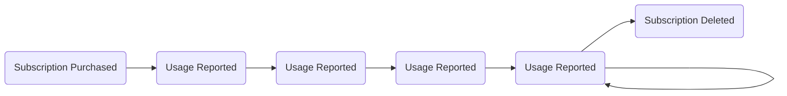

# A pattern for submitting Metering Billing events

This article describes an architectural pattern for properly and reliably aggregating consumption of Azure Marketplace offers, and submitting the consumption via the Azure Marketplace Metering API. 

The Marketplace Metering Service API allows ISVs to enable Azure Marketplace offers such as Azure Managed Applications or Software-as-a-Service applications to charge for consumption, according to custom billing dimensions, as defined by the ISV. As an ISV, you need to run a system which keeps track of the consumption in your application and submits the relevant usage to the Azure Metering Service, in an aggregated and timely fashion. 

> *Aggregated* means that you must cannot submit overage usage directly when it occurs, but aggregate all usage in a given hour. *Timely* refers to the fact that you ideally *should* submit usage in the hour after it occurred, but no later than 24 hours after the fact. According to the [FAQ](https://docs.microsoft.com/en-us/azure/marketplace/marketplace-metering-service-apis-faq), "*the best practice is to collect hourly usage and to emit is as one event at the end of the hour.*"

Your ISV solution report to the metering API that a certain customer subscription in the marketplace (who), consumed a specific amount of units (how much), of a certain billing dimension (what), in a given hour (when). A sample usage record might look like this:

```json
{
   "resourceId":"8151a707-467c-4105-df0b-44c3fca5880d",
   "effectiveStartTime":"2021-12-22T09:00:00Z",
   "planId":"free_monthly_yearly", "dimension": "nodecharge", 
   "quantity": 5.0
}
```

This usage event shows that the SaaS subscription `8151a707-467c-4105-df0b-44c3fca5880d` consumed an aggregated overage of 5.0 `nodecharge` units (in the `free_monthly_yearly` plan), on Wednesday, 22nd of December, 2021, sometime between 09:00:00 and 09:59:59 UTC.

The metering API accepts batches of up to 25 of these usage events to be submitted at once. 

Many ISV solutions share a common set of challenges: As a developer, you certainly want to focus on your solution's functionality, and not spend much effort on understanding how the Azure Marketplace's metering API needs to get your customer's usage information. Azure Marketplace offers with custom dimensions allow for sophisticated business models, which increase the complexity of the solution's billing logic. 

For example, for a given billing dimension, a Marketplace offer might have 'included quantities' for the monthly and/or annual fee. It is up to the ISV's solution, to correctly track and account for these included quantities. The ISV must only report customer usage *above* these included quantities, i.e., only the overage must be reported to Microsoft. In addition, at the time a customer's billing cycle renews, the ISV's accounting system needs to 're-fill' the customer's included quantities. 

**Timely:** The metering API requires ISV solutions to report usage in a timely fashion. The API only accepts usage events which belong to the last 24 hours; older usage events are rejected by the API. Therefore, the ISV's accounting and usage reporting solution needs to reliably and continuously submit usage; running an accounting job once a week is not sufficient. At the same time, the solution certainly doesn't need to run 24x7, as long as it submits data a couple of times a day.

**Aggregated:** The metering API requires usage data to be aggregated on an hourly basis. The ISV solution cannot simply forward all relevant metering events to the metering API, right in the instant when the occur. Instead, usage must be accumulated over an hour, properly handling potentially remaining included quantities, and only submit the overage usage to the metering API, for a past hour, that the customer really has to pay for.

**First write wins:** Last, but not least, the metering API only accepts a single 'first write' for a certain combination of marketplace subscription, billing dimension, and hour. Once the ISV solution reported that a certain consumption happened, subsequent submissions for the same subscription/dimension/timeslot will be rejected as a duplicate. The 'first write wins', and the customer will be charged accordingly. You want to avoid having to correct/update a previously submitted value. 

## The pattern

The pattern described in this document converts the Marketplace's Metered Billing API (which has very tight requirements) into a different API, which hopefully simplifies the development efforts for an ISV. While the Marketplace Metering Service API requires aggregated data in a certain shape and form, the ISV / application developer should be able to just report everything that happens, when it happens. 

### Architectural overview

The following illustration provides an architectural overview:


### Components in the system

- **Event Hubs:** The central component in the architecture is Azure Event Hubs, an 'append-only / log-based data structure', which serves as basis for a pure event-sourced application. Event Hubs serve as the full 'transaction log' for everything that happens in the system. 
- **Event Hubs Partitions:** Event Hubs store messages in **[partitions](https://docs.microsoft.com/en-us/azure/event-hubs/event-hubs-scalability#partitions)**: a partition can be thought of like a 'transaction log': All messages belonging to a certain subscription should always end up in the same partition, to ensure strict ordering. EventHub assigns a time stamp and a sequence number to each message, i.e. each message / event can be uniquely identified by partition ID and sequence number.
- **Event Hubs capture:** It is recommended to enable [Event Hubs Capture](https://docs.microsoft.com/en-us/azure/event-hubs/event-hubs-capture-overview). To avoid that EventHub gets 'too full', EventHub retains messages only for a specified retention period (days / weeks); older messages are removed from the hubs instance. Enabling Event Hubs Capture ensurec that a copy of the event messages is written (as Avro-serialized files) into Azure Blob Storage. That allows you to subsequently analyze and discover usage patterns in your solution, have an auditable log of customer consumption, or trouble-shoot problems. In addition, it allows a replay of a full series of past events in event sourcing.
- **Aggregator:** The aggregator is the (custom) component which contains the aggregation business logic, and which submits the usage to the Azure Marketplace Metering API. The aggregator should ideally be written in a hosting-agnostic way: You might want to run it on a virtual machine on Azure, you might want it to run in Kubernetes on AKS, in an Azure Container Instance, an Azure Function, or on a Raspberry PI under your desk. Ideally the aggregator should provide you with the flexibility to host it in a way that works well for your solution.
- **State Snapshots:** The system should not exclusively rely on Event Hubs (and capture) as the entire data store. Event Sourcing should not force the solution to re-process the entire history, to calculate the state to a given point in time. Therefore, the aggregator should regularly create snapshots of the current system state. The aggregator serializes and stores these snapshots in blob storage.
- **Sending applications:** Multiple parts of the ISV solution might send data into the system. For example, the main ISV workload would send usage events into EventHub, such as 'we performed a machine learning job for subscription 123', or 'we have processed 5.2 GB of data for subscription 435'. In addition to the actual usage, a management system might submit events like creation (or deletion) of a subscription, including the plan's details.

### Messages in EventHub

The solution should support various event types:

- The subscription life cycle is initiated by a `SubscriptionPurchased`  event, and closed by the `SubscriptionDeleted` event. 
  - The `SubscriptionPurchased` event informs the aggregator that usage for a certain resourceId must be tracked. That resourceId would be the SasS subscription ID, or the managed app's resource ID.
  - The `SubscriptionDeleted` event would indicate that a customer cancelled the subscription, so that it no longer is possible to track consumption.
- The `UsageReported` events contain the concrete usage information, i.e. which resource ID has consumed which quantities of which dimension at what point in time.

So a `SubscriptionPurchased`  event starts the process, `UsageReported`  events report on ongoing usage, and the `SubscriptionDeleted` event closes the cycle:




In addition to these events, the aggregator must keep track of what usage has been reported to the Marketplace Metering Service API, or more specifically, how the Marketplace Metering Service API responded to a certain usage event. In the architectural diagram, you can see a feedback loop from the aggregator, writing back into Event Hubs: via this feedback loop, the aggregator ensures that Event Hubs not only contains the usage from within the ISV solution, but also contains the history of all interactions with the Marketplace Metering Service API.


## Links

- Azure Application Offer
  - **Managed application metered billing:** [Metered billing for managed applications using the marketplace metering service](https://docs.microsoft.com/en-us/azure/marketplace/azure-app-metered-billing) ([GH](https://github.com/MicrosoftDocs/azure-docs-pr/blob/main/articles/marketplace/azure-app-metered-billing.md))
  - **Marketplace metered billing APIs**: [Metering service APIs](https://docs.microsoft.com/en-us/azure/marketplace/marketplace-metering-service-apis) ([GH](https://github.com/MicrosoftDocs/azure-docs-pr/blob/main/articles/marketplace/marketplace-metering-service-apis.md))
- SaaS offer
  - [Metered billing for SaaS offers using the Microsoft commercial marketplace metering service](https://docs.microsoft.com/en-us/azure/marketplace/partner-center-portal/saas-metered-billing)
- Commercial Marketplace Documentation
  - [Marketplace metering service authentication strategies supported in Azure Marketplace](https://docs.microsoft.com/en-us/azure/marketplace/marketplace-metering-service-authentication) ([GH](https://github.com/MicrosoftDocs/azure-docs-pr/blob/main/articles/marketplace/marketplace-metering-service-authentication.md))
  - [Metering service APIs](https://docs.microsoft.com/en-us/azure/marketplace/marketplace-metering-service-apis)
  - [Metering service APIs FAQ - Microsoft commercial marketplace](https://docs.microsoft.com/en-us/azure/marketplace/marketplace-metering-service-apis-faq)
